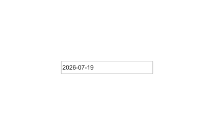

# uidatepicker

Create date picker component.

## 📝 Syntax

- h = uidatepicker()
- h = uidatepicker(parent)
- h = uidatepicker(..., propertyName, propertyValue)

## 📥 Input argument

- parent - parent container.
- propertyName, propertyValue - name-value pairs.

## 📤 Output argument

- h - UI component object.

## 📄 Description

<b>d = uidatepicker</b> creates a date picker whose <b>Value</b> is a datetime scalar (NaT when empty). Properties: <b>DisplayFormat</b> (LDML), <b>Limits</b>, <b>DisabledDates</b>, <b>DisabledDaysOfWeek</b>, <b>Editable</b>, <b>ValueChangedFcn</b>.

## 💡 Examples

Captured UI component for the help image.

```matlab
f = uifigure('Visible', 'off', 'Name', 'Date picker', 'Position', [100 100 420 260]);
dp = uidatepicker(f, 'Position', [120 115 180 24]);
dp.Value = datetime(2026, 7, 19);
drawnow();
```


uidatepicker

```matlab

f = uifigure();
d = uidatepicker(f, 'Value', datetime(2026, 7, 18));

```

## 🔗 See also

[uifigure](../../../gui/uifigure.md).

## 🕔 History

| Version | 📄 Description  |
| ------- | --------------- |
| 2.0.0   | initial version |

<!--
## 👤 Author

Allan CORNET
-->
