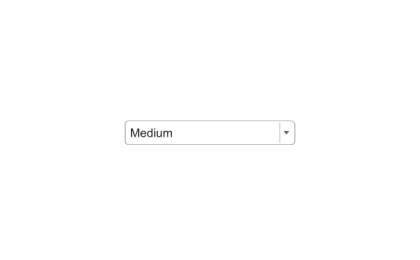

# uidropdown

Create drop-down component.

## 📝 Syntax

- h = uidropdown()
- h = uidropdown(parent)
- h = uidropdown(..., propertyName, propertyValue)

## 📥 Input argument

- parent - parent container.
- propertyName, propertyValue - name-value pairs.

## 📤 Output argument

- h - UI component object.

## 📄 Description

<b>dd = uidropdown</b> creates a drop-down list. <b>Items</b> holds the displayed entries; <b>ItemsData</b> optionally maps each entry to a data value returned through <b>Value</b>. <b>ValueIndex</b> is the 1-based selection index. <b>Editable</b> 'on' lets the user type free text. Callback <b>ValueChangedFcn</b> (event data: <b>Value</b>, <b>PreviousValue</b>, <b>Edited</b>, <b>ValueIndex</b>, <b>PreviousValueIndex</b>).

## 💡 Examples

Captured UI component for the help image.

```matlab
f = uifigure('Visible', 'off', 'Name', 'Drop down', 'Position', [100 100 420 260]);
dd = uidropdown(f, 'Items', {'Small', 'Medium', 'Large'}, 'Position', [125 115 170 24]);
dd.Value = 'Medium';
drawnow();
```


uidropdown

```matlab

f = uifigure();
dd = uidropdown(f, 'Items', {'Red', 'Green', 'Blue'}, 'ItemsData', [1 2 3]);
dd.Value = 2;

```

## 🔗 See also

[uifigure](../../../gui/uifigure.md).

## 🕔 History

| Version | 📄 Description  |
| ------- | --------------- |
| 2.0.0   | initial version |

<!--
## 👤 Author

Allan CORNET
-->
