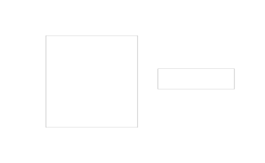

# uigauge

Create gauge component (circular, linear, ninetydegree, semicircular).

## 📝 Syntax

- h = uigauge()
- h = uigauge(parent)
- h = uigauge(..., propertyName, propertyValue)

## 📥 Input argument

- parent - parent container.
- propertyName, propertyValue - name-value pairs.

## 📤 Output argument

- h - UI component object.

## 📄 Description


<b>g = uigauge(parent, style)</b> creates a display-only gauge: styles <b>'circular'</b> (default), <b>'linear'</b>, <b>'ninetydegree'</b>, <b>'semicircular'</b>. Properties: <b>Value</b>, <b>Limits</b>, <b>ScaleColors</b>/<b>ScaleColorLimits</b>, ticks, <b>Orientation</b> or <b>ScaleDirection</b> depending on the style.

## 💡 Examples

Captured UI component for the help image.

```matlab
f = uifigure('Visible', 'off', 'Name', 'Gauges', 'Position', [100 100 520 320]);
g = uigauge(f);
g.Position = [90 70 180 180];
g.Value = 75;
lg = uigauge(f, 'linear');
lg.Position = [310 145 150 40];
lg.Value = 45;
drawnow();
```

uigauge

```matlab

f = uifigure();
g = uigauge(f, 'Value', 75);
lg = uigauge(f, 'linear', 'Orientation', 'vertical');

```


## 🔗 See also

[uifigure](../../../gui/uifigure.md).

## 🕔 History

| Version | 📄 Description     |
| ------- | --------------- |
| 2.0.0   | initial version |

<!--
## 👤 Author

Allan CORNET
-->
