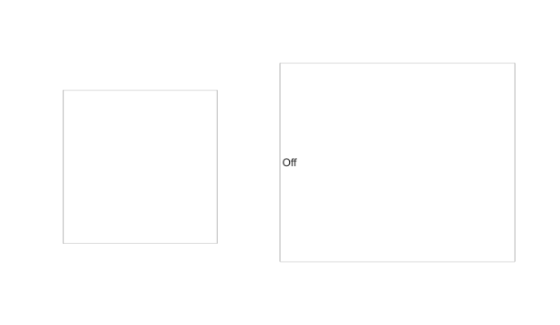

# uiknob

Create knob or discrete knob component.

## 📝 Syntax

- h = uiknob()
- h = uiknob(parent)
- h = uiknob(..., propertyName, propertyValue)

## 📥 Input argument

- parent - parent container.
- propertyName, propertyValue - name-value pairs.

## 📤 Output argument

- h - UI component object.

## 📄 Description

<b>kb = uiknob</b> creates a continuous knob (<b>Value</b>/<b>Limits</b>/ticks/<b>ValueChangingFcn</b>); <b>uiknob(parent, 'discrete')</b> creates a discrete knob using <b>Items</b>/<b>ItemsData</b>/<b>ValueIndex</b>.

## 💡 Examples

Captured UI component for the help image.

```matlab
f = uifigure('Visible', 'off', 'Name', 'Knobs', 'Position', [100 100 620 360]);
kb = uiknob(f);
kb.Position = [70 90 170 170];
kb.Value = 55;
dk = uiknob(f, 'discrete');
dk.Position = [310 70 260 220];
dk.Value = 'Medium';
drawnow();
```


uiknob

```matlab

f = uifigure();
kb = uiknob(f, 'Value', 30);
dk = uiknob(f, 'discrete', 'Items', {'Low', 'High'});

```

## 🔗 See also

[uifigure](../../../gui/uifigure.md).

## 🕔 History

| Version | 📄 Description  |
| ------- | --------------- |
| 2.0.0   | initial version |

<!--
## 👤 Author

Allan CORNET
-->
