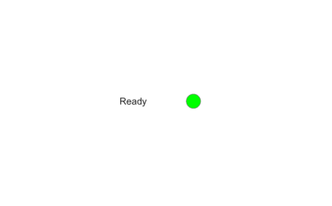

# uilamp

Create lamp component.

## 📝 Syntax

- h = uilamp()
- h = uilamp(parent)
- h = uilamp(..., propertyName, propertyValue)

## 📥 Input argument

- parent - parent container.
- propertyName, propertyValue - name-value pairs.

## 📤 Output argument

- h - UI component object.

## 📄 Description


<b>lmp = uilamp</b> creates a lamp, a display-only circular indicator whose <b>Color</b> reflects a state.

## 💡 Examples

Captured UI component for the help image.

```matlab
f = uifigure('Visible', 'off', 'Name', 'Lamp', 'Position', [100 100 420 260]);
lbl = uilabel(f, 'Text', 'Ready', 'Position', [150 120 80 24]);
lmp = uilamp(f, 'Position', [235 122 20 20]);
lmp.Color = 'green';
drawnow();
```

uilamp

```matlab

f = uifigure();
lmp = uilamp(f, 'Color', 'red');

```


## 🔗 See also

[uifigure](../../../gui/uifigure.md).

## 🕔 History

| Version | 📄 Description     |
| ------- | --------------- |
| 2.0.0   | initial version |

<!--
## 👤 Author

Allan CORNET
-->
