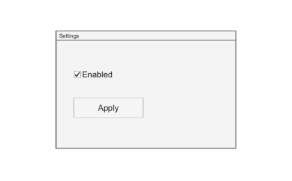

# uipanel

Create panel container.

## 📝 Syntax

- h = uipanel()
- h = uipanel(parent)
- h = uipanel(..., propertyName, propertyValue)

## 📥 Input argument

- parent - parent container (uifigure, figure, uipanel, uitab, uibuttongroup, uigridlayout).
- propertyName, propertyValue - name-value pairs.

## 📤 Output argument

- h - container object.

## 📄 Description

<b>p = uipanel</b> creates a panel container in a new figure (uifigure). A panel groups UI components; children are positioned relative to the panel. Main properties: <b>Title</b>, <b>TitlePosition</b> ('lefttop', 'centertop', 'righttop'), <b>BackgroundColor</b>, <b>ForegroundColor</b>, <b>BorderType</b> ('line', 'none'), <b>BorderWidth</b>, <b>BorderColor</b>, <b>Position</b>, <b>Scrollable</b>, <b>AutoResizeChildren</b>, <b>SizeChangedFcn</b>.

## 💡 Examples

Captured UI component for the help image.

```matlab
f = uifigure('Visible', 'off', 'Name', 'Panel', 'Position', [100 100 420 260]);
p = uipanel(f, 'Title', 'Settings', 'Position', [80 45 260 170]);
uicheckbox(p, 'Text', 'Enabled', 'Value', true, 'Position', [25 95 120 24]);
uibutton(p, 'Text', 'Apply', 'Position', [25 45 100 28]);
drawnow();
```


uipanel

```matlab

f = uifigure();
p = uipanel(f, 'Title', 'Options', 'Position', [20 20 260 221]);
b = uibutton(p, 'Text', 'OK', 'Position', [20 20 100 22]);

```

## 🔗 See also

[uifigure](../../../gui/uifigure.md).

## 🕔 History

| Version | 📄 Description  |
| ------- | --------------- |
| 2.0.0   | initial version |

<!--
## 👤 Author

Allan CORNET
-->
