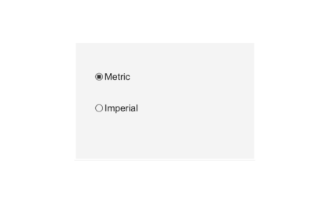

# uiradiobutton

Create radio button in a button group.

## 📝 Syntax

- h = uiradiobutton()
- h = uiradiobutton(parent)
- h = uiradiobutton(..., propertyName, propertyValue)

## 📥 Input argument

- parent - parent container.
- propertyName, propertyValue - name-value pairs.

## 📤 Output argument

- h - UI component object.

## 📄 Description


<b>rb = uiradiobutton(bg)</b> creates a radio button inside a uibuttongroup. The first button added to a group is selected. Selection is exclusive; changes are reported by the group <b>SelectionChangedFcn</b>. Properties: <b>Value</b> (logical), <b>Text</b>, <b>WordWrap</b>, fonts.

## 💡 Examples

Captured UI component for the help image.

```matlab
f = uifigure('Visible', 'off', 'Name', 'Radio buttons', 'Position', [100 100 420 260]);
bg = uibuttongroup(f, 'Position', [95 55 230 150]);
r1 = uiradiobutton(bg, 'Text', 'Metric', 'Position', [25 95 120 22]);
r2 = uiradiobutton(bg, 'Text', 'Imperial', 'Position', [25 55 120 22]);
r1.Value = true;
drawnow();
```

uiradiobutton

```matlab

f = uifigure();
bg = uibuttongroup(f, 'Title', 'Options');
rb1 = uiradiobutton(bg, 'Text', 'First');
rb2 = uiradiobutton(bg, 'Text', 'Second');
rb2.Value = true;

```


## 🔗 See also

[uifigure](../../../gui/uifigure.md).

## 🕔 History

| Version | 📄 Description     |
| ------- | --------------- |
| 2.0.0   | initial version |

<!--
## 👤 Author

Allan CORNET
-->
