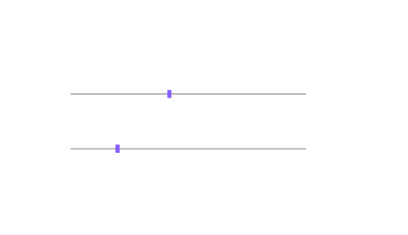

# uislider

Create slider or range slider component.

## 📝 Syntax

- h = uislider()
- h = uislider(parent)
- h = uislider(..., propertyName, propertyValue)

## 📥 Input argument

- parent - parent container.
- propertyName, propertyValue - name-value pairs.

## 📤 Output argument

- h - UI component object.

## 📄 Description

<b>sld = uislider</b> creates a slider; <b>uislider(parent, 'range')</b> creates a range slider whose <b>Value</b> is a two-element vector. Properties: <b>Value</b>, <b>Limits</b>, <b>Orientation</b>, <b>MajorTicks</b>/<b>MinorTicks</b>/<b>MajorTickLabels</b> with auto/manual modes, <b>Step</b>/<b>StepMode</b>, <b>ValueChangedFcn</b>, <b>ValueChangingFcn</b>.

## 💡 Examples

Captured UI component for the help image.

```matlab
f = uifigure('Visible', 'off', 'Name', 'Slider', 'Position', [100 100 520 300]);
sld = uislider(f, 'Position', [90 165 300 30]);
sld.Value = 42;
rs = uislider(f, 'range');
rs.Position = [90 95 300 30];
rs.Value = [20 70];
drawnow();
```


uislider

```matlab

f = uifigure();
sld = uislider(f, 'Limits', [0 10], 'Value', 4);
rs = uislider(f, 'range', 'Value', [20 60]);

```

## 🔗 See also

[uifigure](../../../gui/uifigure.md).

## 🕔 History

| Version | 📄 Description  |
| ------- | --------------- |
| 2.0.0   | initial version |

<!--
## 👤 Author

Allan CORNET
-->
