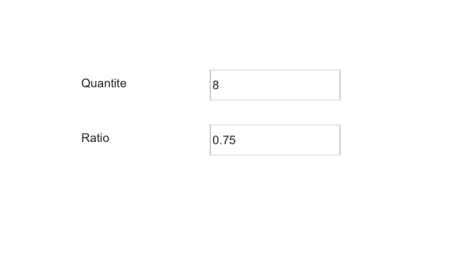

# uispinner

Create spinner component.

## 📝 Syntax

- h = uispinner()
- h = uispinner(parent)
- h = uispinner(..., propertyName, propertyValue)

## 📥 Input argument

- parent - parent container.
- propertyName, propertyValue - name-value pairs.

## 📤 Output argument

- h - UI component object.

## 📄 Description

<b>spn = uispinner</b> creates a numeric spinner. Properties: <b>Value</b>, <b>Step</b>, <b>Limits</b>, <b>LowerLimitInclusive</b>/<b>UpperLimitInclusive</b>, <b>RoundFractionalValues</b>, <b>ValueDisplayFormat</b>, <b>AllowEmpty</b>, <b>Editable</b>, <b>ValueChangedFcn</b>, <b>ValueChangingFcn</b>.

## 💡 Examples

Captured UI component for the help image.

```matlab
f = uifigure('Visible', 'off', 'Name', 'Spinners', 'Position', [100 100 460 280]);
uilabel(f, 'Text', 'Quantity', 'FontWeight', 'bold', 'Position', [80 185 100 24]);
qty = uispinner(f, 'Value', 8, 'Step', 1, 'Limits', [0 20], 'Position', [210 180 130 30]);
uilabel(f, 'Text', 'Ratio', 'FontWeight', 'bold', 'Position', [80 130 100 24]);
ratio = uispinner(f, 'Value', 0.75, 'Step', 0.05, 'Limits', [0 1], 'Position', [210 125 130 30]);
drawnow();
```


uispinner

```matlab

f = uifigure();
spn = uispinner(f, 'Value', 5, 'Step', 0.5, 'Limits', [0 10]);

```

## 🔗 See also

[uifigure](../../../gui/uifigure.md).

## 🕔 History

| Version | 📄 Description  |
| ------- | --------------- |
| 2.0.0   | initial version |

<!--
## 👤 Author

Allan CORNET
-->
