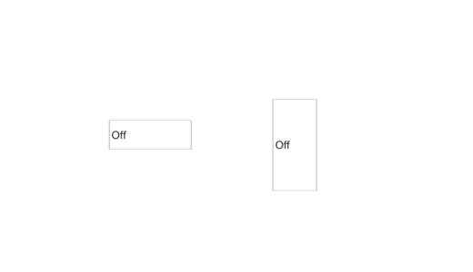

# uiswitch

Create switch component (slider, rocker, toggle).

## 📝 Syntax

- h = uiswitch()
- h = uiswitch(parent)
- h = uiswitch(..., propertyName, propertyValue)

## 📥 Input argument

- parent - parent container.
- propertyName, propertyValue - name-value pairs.

## 📤 Output argument

- h - UI component object.

## 📄 Description

<b>sw = uiswitch(parent, style)</b> creates a two-state switch: styles <b>'slider'</b> (default), <b>'rocker'</b>, <b>'toggle'</b>. <b>Items</b> holds the two state labels; <b>Value</b>/<b>ValueIndex</b>/<b>ItemsData</b> follow the usual mapping; <b>ValueChangedFcn</b> reports changes.

## 💡 Examples

Captured UI component for the help image.

```matlab
f = uifigure('Visible', 'off', 'Name', 'Switches', 'Position', [100 100 520 300]);
sw = uiswitch(f, 'Position', [120 135 90 32]);
sw.Value = 'On';
rsw = uiswitch(f, 'rocker');
rsw.Position = [300 90 48 100];
rsw.Value = 'On';
drawnow();
```


uiswitch

```matlab

f = uifigure();
sw = uiswitch(f, 'Items', {'Stop', 'Go'});
sw.Value = 'Go';

```

## 🔗 See also

[uifigure](../../../gui/uifigure.md).

## 🕔 History

| Version | 📄 Description  |
| ------- | --------------- |
| 2.0.0   | initial version |

<!--
## 👤 Author

Allan CORNET
-->
