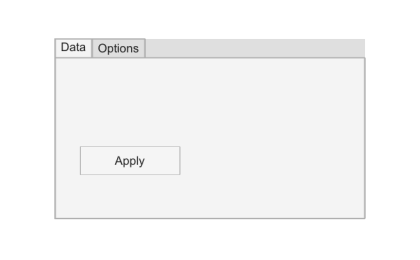

# uitab

Create tab container.

## 📝 Syntax

- h = uitab()
- h = uitab(parent)
- h = uitab(..., propertyName, propertyValue)

## 📥 Input argument

- parent - parent container (uifigure, figure, uipanel, uitab, uibuttongroup, uigridlayout).
- propertyName, propertyValue - name-value pairs.

## 📤 Output argument

- h - container object.

## 📄 Description

<b>t = uitab</b> creates a tab inside a tab group and returns the Tab object. If the given parent is not a TabGroup, an implicit uitabgroup is created. Main properties: <b>Title</b>, <b>BackgroundColor</b>, <b>ForegroundColor</b>, <b>Scrollable</b>. The tab geometry is managed by the parent TabGroup (read-only <b>Position</b>).

## 💡 Examples

Captured UI component for the help image.

```matlab
f = uifigure('Visible', 'off', 'Name', 'Tabs', 'Position', [100 100 420 260]);
tg = uitabgroup(f, 'Position', [55 40 310 180]);
t = uitab(tg, 'Title', 'Data');
uitab(tg, 'Title', 'Options');
uibutton(t, 'Text', 'Apply', 'Position', [25 45 100 28]);
drawnow();
```


uitab

```matlab

f = uifigure();
tg = uitabgroup(f);
t = uitab(tg, 'Title', 'Settings');
b = uibutton(t, 'Text', 'Apply', 'Position', [20 20 100 22]);

```

## 🔗 See also

[uifigure](../../../gui/uifigure.md).

## 🕔 History

| Version | 📄 Description  |
| ------- | --------------- |
| 2.0.0   | initial version |

<!--
## 👤 Author

Allan CORNET
-->
