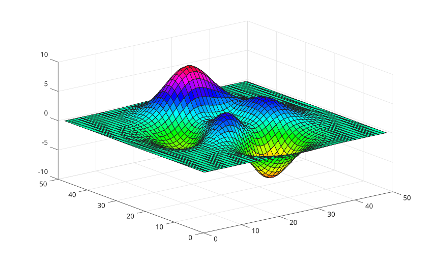

# hsv

Hue-saturation-value colormap array.

## 📝 Syntax

- c = hsv
- c = hsv(m)

## 📥 Input argument

- m - a scalar integer value: Number of colors (256 as default value).

## 📤 Output argument

- c - Hue-saturation-value colormap array.

## 📄 Description


<b>hsv</b> returns a colormap that varies the hue around the color wheel.

## 💡 Example


```matlab
f = figure();
surf(peaks);
colormap('hsv');
```



## 🔗 See also

[colormap](../../../../graphics/3_labels_styling/2_color_styling/colormaps/colormap.md).

## 🕔 History

| Version | 📄 Description     |
| ------- | --------------- |
| 1.15.0   | initial version |

<!--
## 👤 Author

Allan CORNET
-->
