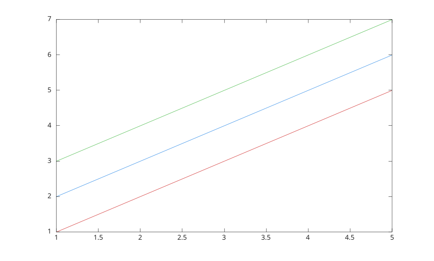

# colororder

Set or query axes color order.

## 📝 Syntax

- colororder(colors)
- colororder(name)
- colororder(ax, ...)
- colors = colororder
- colors = colororder(ax)

## 📥 Input argument

- colors - n-by-3 real numeric matrix containing RGB color values.
- name - named color order: 'default', 'gem', 'glow', 'sail', 'reef', 'meadow', 'dye', or 'earth'.
- ax - target axes object. If omitted, the current axes is used.

## 📤 Output argument

- colors - current axes color order as an n-by-3 RGB matrix.

## 📄 Description

<b>colororder</b> sets or queries the <b>ColorOrder</b> property of an axes.

Setting a color order resets <b>ColorOrderIndex</b> to 1. Bar objects whose face color is automatic are updated from the new order.

## 💡 Examples

Use a named color order for grouped bars.

```matlab
f = figure();
colororder('reef');
bar([1 3 5; 2 4 6; 3 5 7]);

```


Set a custom RGB color order.

```matlab
f = figure();
ax = axes('Parent', f);
colororder(ax, [0.8 0.1 0.1; 0.1 0.5 0.9; 0.2 0.7 0.2]);
y = [1:5; 2:6; 3:7]';
plot(ax, 1:5, y);

```



## 🔗 See also

[axes](../../../graphics/2_graphics_objects/1_object_management/axes.md), [bar](../../../graphics/1_plots/6_discrete_data_plots/bar.md), [plot](../../../graphics/1_plots/1_line_plots/plot.md).

<!--
## 👤 Author

Allan CORNET
-->
