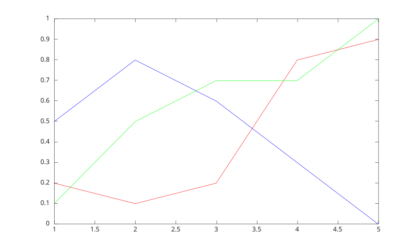

# rgbplot

Plot colormap.

## 📝 Syntax

- rgbplot(cmap)

## 📥 Input argument

- cmap - Colormap: three-column matrix of RGB triplets .

## 📄 Description

<b>rgbplot(cmap)</b> plots the R (red), G (green), and B (blue) intensities of the specified<b>cmap</b> colormap.

## 💡 Example

```matlab
f  = figure();
colormap = [0.2 0.1 0.5;
    0.1 0.5 0.8;
    0.2 0.7 0.6;
    0.8 0.7 0.3;
    0.9 1 0];
rgbplot(colormap);
```



## 🔗 See also

[plot](../../../graphics/1_plots/1_line_plots/plot.md), [colormap](../../../graphics/3_labels_styling/2_color_styling/colormaps/colormap.md).

## 🕔 History

| Version | 📄 Description  |
| ------- | --------------- |
| 1.0.0   | initial version |

<!--
## 👤 Author

Allan CORNET
-->
