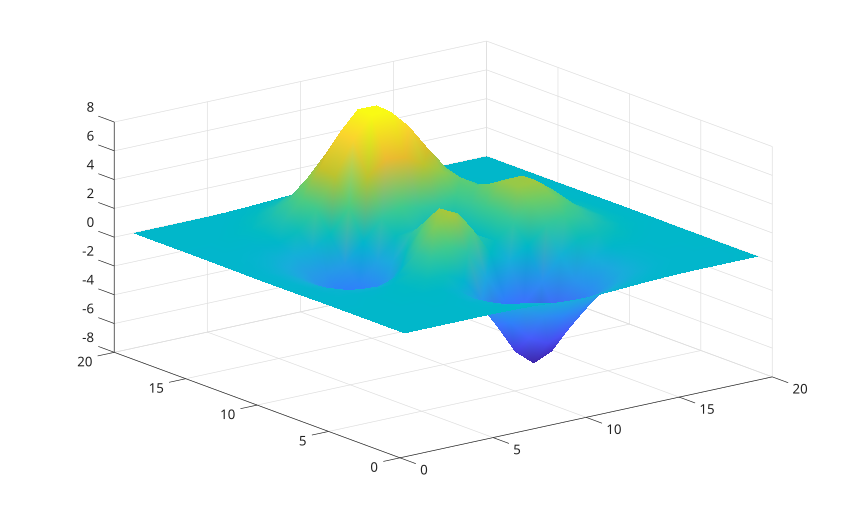

# shading

Set surface and patch shading mode.

## 📝 Syntax

- shading(type)
- shading(ax, type)

## 📥 Input argument

- ax - target axes.
- type - <b>faceted</b>, <b>flat</b>, or <b>interp</b>.

## 📄 Description


<b>shading</b> changes the <b>FaceColor</b> and <b>EdgeColor</b> of surface and patch children in axes.

## 💡 Example


```matlab

surf(peaks(20));
shading interp;

```



## 🔗 See also

[surf](../../../graphics/1_plots/7_surfaces_volumes_polygons/surf.md), [lighting](../../../graphics/3_labels_styling/3_interactions_camera_lighting/lighting.md).

## 🕔 History

| Version | 📄 Description     |
| ------- | --------------- |
| 2.0.0   | initial version |

<!--
## 👤 Author

Allan CORNET
-->
