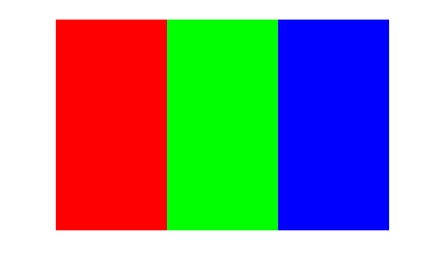

# validatecolor

Validate color values.

## 📝 Syntax

- RGB = validatecolor(colors)
- RGB = validatecolor(colors, sz)

## 📥 Input argument

- colors - 1-by-3 vector, m-by-3 matrix, character vector, 1-D cell array of character vectors or 1-D string array.
- sz - 'one' (default) or 'multiple'

## 📤 Output argument

- RGB - RGB values: RGB triplet or matrix of RGB triplets.

## 📄 Description


The <b>validatecolor</b> function is a color validation function that checks whether a given color is valid according to Nelson standards. 

It takes a color argument as input and returns an error if the color is not valid. 

Hexadecimal color codes use six ('#FF8800') or three ('#F80') hexadecimal digits.

## 💡 Example


```matlab
RGB = validatecolor('red')
RGB = validatecolor('#8000FF')
RGB = validatecolor({'#8000FF','#00FF00','#FF9900'}, 'multiple')
RGB = validatecolor({'red','green','blue'},'multiple')
image(reshape(RGB, [1, size(RGB, 1), 3]));
axis off

```



## 🕔 History

| Version | 📄 Description     |
| ------- | --------------- |
| 1.0.0   | initial version |
| 2.0.0   | 3-digit hexadecimal color codes ('#F80') accepted, exact k/255 values for hexadecimal codes, error for non 1-D cell or string arrays. |

<!--
## 👤 Author

Allan CORNET
-->
