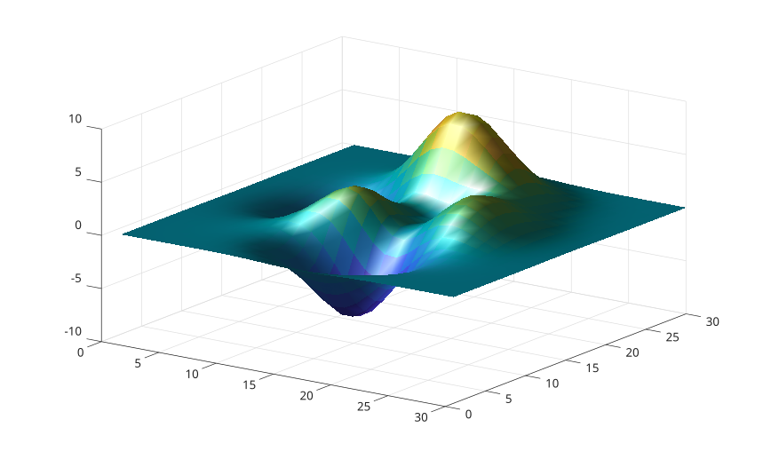

# camlight

Create or position a light relative to the camera.

## 📝 Syntax

- camlight()
- camlight('headlight')
- camlight('left')
- camlight('right')
- camlight(az, el)
- go = camlight(...)

## 📄 Description

<b>camlight</b> creates or repositions an infinite light using the current axes camera or a relative angular position.

## 💡 Example

```matlab

surf(peaks(30), 'EdgeColor', 'none', 'FaceLighting', 'gouraud');
camlight('headlight');
material('shiny');
view(35, 28);

```



## 🔗 See also

[light](../../../graphics/3_labels_styling/3_interactions_camera_lighting/light.md), [lightangle](../../../graphics/3_labels_styling/3_interactions_camera_lighting/lightangle.md).

## 🕔 History

| Version | 📄 Description  |
| ------- | --------------- |
| 2.0.0   | initial version |

<!--
## 👤 Author

Allan CORNET
-->
