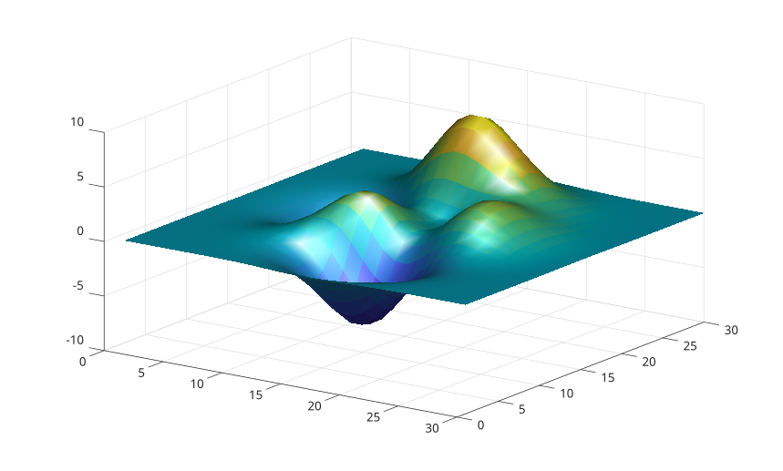

# light

Create a light object in axes.

## 📝 Syntax

- light()
- light(ax, ...)
- light(..., propertyName, propertyValue)
- go = light(...)

## 📥 Input argument

- ax - target axes.
- propertyName - light property name.
- propertyValue - light property value.

## 📤 Output argument

- go - a graphics object: light type.

## 📄 Description

<b>light</b> creates a light object in axes. Visible light objects affect surface and patch objects in the same axes when their lighting properties are enabled.

See [light properties](../../../graphics/2_graphics_objects/4_properties/nelson.graphics.light.properties.md) for the complete property list.

## 💡 Example

```matlab

f = figure();
surf(peaks(30), 'EdgeColor', 'none', 'FaceLighting', 'gouraud');
light('Position', [1 -1 1]);
material('shiny');
view(35, 28);

```



## 🔗 See also

[light properties](../../../graphics/2_graphics_objects/4_properties/nelson.graphics.light.properties.md), [lighting](../../../graphics/3_labels_styling/3_interactions_camera_lighting/lighting.md), [material](../../../graphics/3_labels_styling/3_interactions_camera_lighting/material.md), [surf](../../../graphics/1_plots/7_surfaces_volumes_polygons/surf.md).

## 🕔 History

| Version | 📄 Description  |
| ------- | --------------- |
| 2.0.0   | initial version |

<!--
## 👤 Author

Allan CORNET
-->
