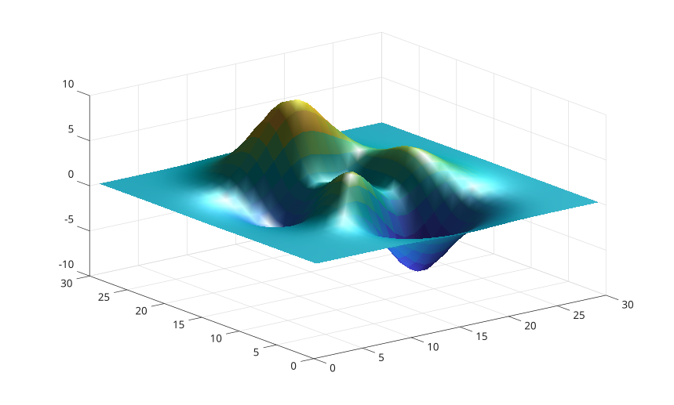

# lighting

Set surface and patch lighting mode.

## 📝 Syntax

- lighting(type)
- lighting(ax, type)

## 📥 Input argument

- ax - target axes.
- type - <b>none</b>, <b>flat</b>, or <b>gouraud</b>.

## 📄 Description

<b>lighting</b> sets <b>FaceLighting</b> and <b>EdgeLighting</b> on surface and patch children in axes.

## 💡 Example

```matlab

surf(peaks(30), 'EdgeColor', 'none');
light();
lighting gouraud;

```



## 🔗 See also

[light](../../../graphics/3_labels_styling/3_interactions_camera_lighting/light.md), [material](../../../graphics/3_labels_styling/3_interactions_camera_lighting/material.md).

## 🕔 History

| Version | 📄 Description  |
| ------- | --------------- |
| 2.0.0   | initial version |

<!--
## 👤 Author

Allan CORNET
-->
