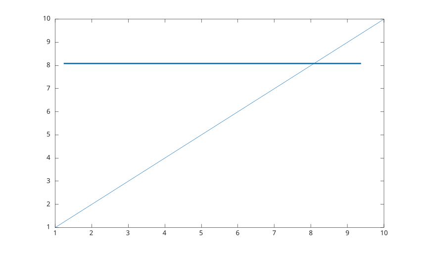
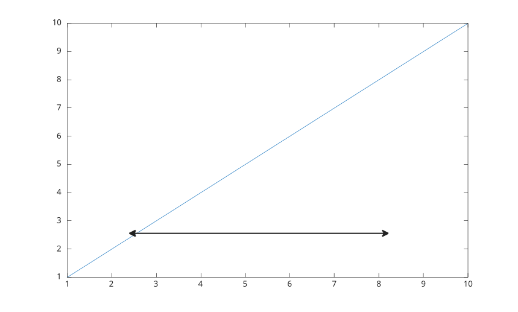
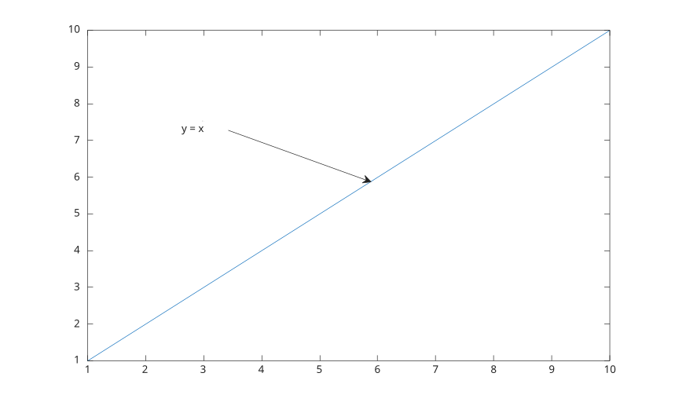
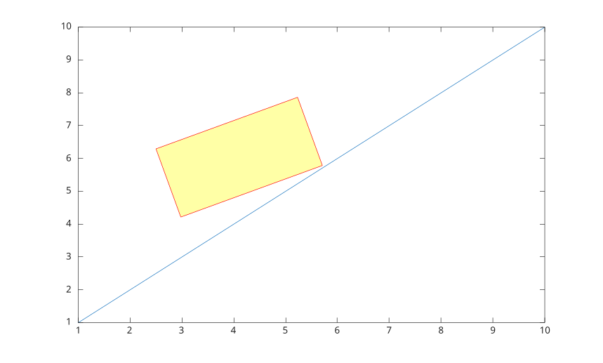
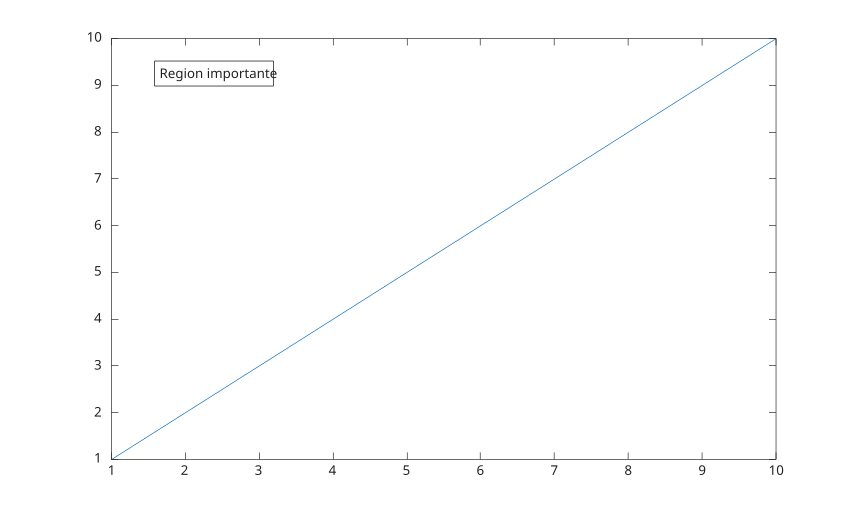

# annotation

Create figure annotations.

## 📝 Syntax

- annotation(lineType, x, y)
- annotation(lineType)
- annotation(shapeType, dim)
- annotation(shapeType)
- annotation(..., propertyName, propertyValue)
- annotation(fig, ...)
- go = annotation(...)

## 📥 Input argument

- lineType - 'line', 'arrow', 'doublearrow', or 'textarrow'.
- shapeType - 'rectangle', 'ellipse', or 'textbox'.
- x, y - Two-element vectors defining beginning and ending coordinates.
- dim - Four-element vector [x y w h].
- fig - Target figure.

## 📤 Output argument

- go - Annotation graphics object.

## 📄 Description

<b>annotation</b> creates annotations in figure coordinates. Default units are normalized.

Supported units are 'normalized', 'inches', 'centimeters', 'characters', 'points', and 'pixels'.

See [annotation properties](../../../graphics/2_graphics_objects/4_properties/nelson.graphics.annotation.properties.md) for the complete property list.

## 💡 Examples

Add a line annotation.

```matlab

f = figure();
plot(1:10);
annotation('line', [0.15 0.85], [0.75 0.75], ...
  'Color', [0 0.45 0.74], 'LineWidth', 2);

```


Add an arrow annotation.

```matlab

f = figure();
plot(1:10);
annotation('arrow', [0.25 0.55], [0.65 0.45], ...
  'Color', 'red', 'LineStyle', '--', 'HeadStyle', 'plain');

```


Add a double arrow annotation.

```matlab

f = figure();
plot(1:10);
annotation('doublearrow', [0.25 0.75], [0.25 0.25], ...
  'Head1Style', 'vback1', 'Head2Style', 'cback3', 'LineWidth', 1.5);

```


Add a text arrow annotation.

```matlab

f = figure();
plot(1:10);
annotation('textarrow', [0.3 0.55], [0.7 0.55], ...
  'String', 'y = x', 'TextBackgroundColor', 'white');

```


Add a rectangle annotation.

```matlab

f = figure();
plot(1:10);
annotation('rectangle', [0.3 0.4 0.25 0.2], ...
  'Color', 'red', 'FaceColor', 'yellow', 'FaceAlpha', 0.35, 'Rotation', 20);

```


Add an ellipse annotation.

```matlab

f = figure();
plot(1:10);
annotation('ellipse', [0.55 0.35 0.25 0.2], ...
  'Color', [0.49 0.18 0.56], 'FaceColor', 'none', 'LineWidth', 1.5);

```


Add a text box annotation.

```matlab

f = figure();
plot(1:10);
annotation('textbox', [0.18 0.78 0.28 0.1], ...
  'String', 'Important region', 'FitBoxToText', 'on', ...
  'BackgroundColor', 'white', 'EdgeColor', 'black');

```



## 🔗 See also

[annotation properties](../../../graphics/2_graphics_objects/4_properties/nelson.graphics.annotation.properties.md).
