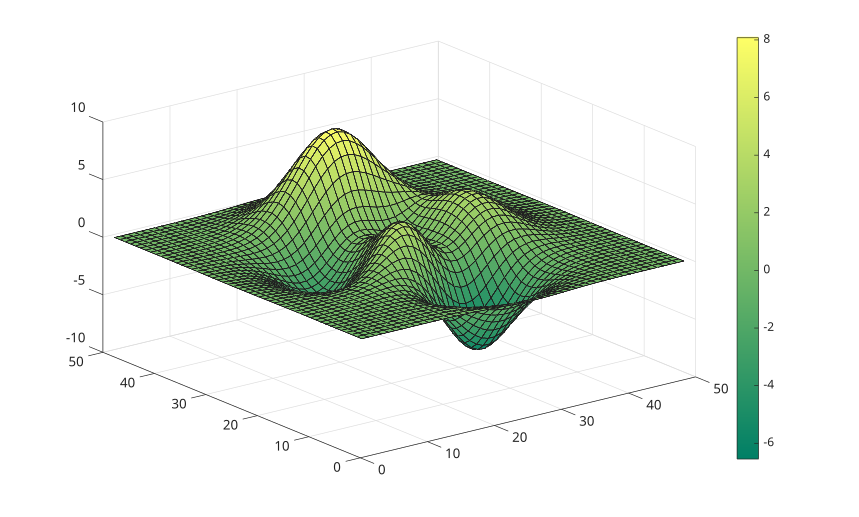
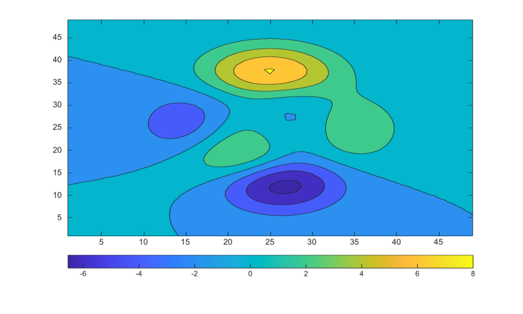

# colorbar

Add a color scale to axes.

## 📝 Syntax

- colorbar
- colorbar(location)
- colorbar(target, ...)
- colorbar('peer', target, ...)
- colorbar(..., propertyName, propertyValue)
- colorbar('off')
- colorbar('delete')
- colorbar('hide')
- colorbar(target, 'off')
- colorbar(c, 'off')
- c = colorbar(...)

## 📥 Input argument

- location - Colorbar location: 'eastoutside', 'westoutside', 'northoutside', 'southoutside', 'east', 'west', 'north', 'south', or 'manual'. The tokens 'horizontal' and 'vertical' are accepted as compatibility aliases for 'southoutside' and 'eastoutside'.
- target - Axes that owns the color scale. If omitted, the current axes is used.
- c - Colorbar graphics object.
- propertyName, propertyValue - Name-value pairs used to set colorbar properties when it is created.
- 'off', 'delete', 'hide' - Delete the colorbar associated with the current axes, the specified axes, or the specified colorbar.

## 📤 Output argument

- c - Colorbar graphics object.

## 📄 Description


<b>colorbar</b> adds a color scale to a plot. The colorbar is a graphics object parented to the figure and associated with a peer axes. 

The default location is <b>eastoutside</b>. Outside locations reserve space next to the peer axes. Inside locations draw the colorbar over the axes area. Setting the <b>Position</b> property changes <b>Location</b> to <b>manual</b>. 

The <b>Location</b> property also accepts <b>layout</b> for tiled layouts. Use <b>colorbar(ax, 'Location', 'layout')</b> and set <b>c.Layout.Tile</b> to a tile number or to 'east', 'west', 'north', or 'south'. The positional form <b>colorbar(ax, 'layout')</b> is not accepted. 

Important visual properties include <b>Box</b>, <b>Color</b>, <b>Direction</b>, <b>FontAngle</b>, <b>FontName</b>, <b>FontSize</b>, <b>FontWeight</b>, <b>Limits</b>, <b>LineWidth</b>, <b>AxisLocation</b>, <b>TickDirection</b>, <b>TickLabelInterpreter</b>, <b>TickLabels</b>, <b>TickLength</b>, <b>Ticks</b>, <b>Units</b>, <b>Visible</b>, and <b>Label</b>. 

Automatic <b>Limits</b>, <b>Ticks</b>, and <b>TickLabels</b> are updated from the peer axes color limits and colormap. Assigning <b>Limits</b>, <b>Ticks</b>, <b>TickLabels</b>, <b>AxisLocation</b>, or <b>Position</b> switches the corresponding mode property to manual when appropriate. 

See [colorbar properties](../../../graphics/2_graphics_objects/4_properties/nelson.graphics.colorbar.properties.md) for the complete property list.

## 💡 Examples

Display a vertical colorbar for a surface.

```matlab
figure();
surf(peaks);
colormap('summer');
colorbar;
```

Place a horizontal colorbar below filled contours.

```matlab
figure();
contourf(peaks);
colormap('parula');
colorbar('southoutside');
```

Customize ticks, labels, and the colorbar label.

```matlab
figure();
imagesc(peaks);
cb = colorbar('Ticks', [-6 -3 0 3 6], ...
  'TickLabels', {'low'; '-3'; '0'; '3'; 'high'});
cb.Label.String = 'Scale';
cb.Direction = 'reverse';
```

Attach a colorbar to a tiled layout edge.

```matlab
figure();
t = tiledlayout(1, 2);
ax1 = nexttile(t);
imagesc(peaks);
title(ax1, 'Tile 1');
ax2 = nexttile(t);
contourf(peaks);
title(ax2, 'Tile 2');
cb = colorbar(ax2, 'Location', 'layout');
cb.Layout.Tile = 'east';
```

Try every standard location.

```matlab
locations = {'north'; 'south'; 'east'; 'west'; ...
  'northoutside'; 'southoutside'; 'eastoutside'; 'westoutside'};
figure();
surf(peaks);
colormap('jet');
for k = 1:length(locations)
  colorbar(locations{k});
  pause(1);
end
```


## 🔗 See also

[colorbar properties](../../../graphics/2_graphics_objects/4_properties/nelson.graphics.colorbar.properties.md), [colormap](../../../graphics/3_labels_styling/2_color_styling/colormaps/colormap.md), [clim](../../../graphics/3_labels_styling/2_color_styling/clim.md), [contourf](../../../graphics/1_plots/3_contour_plots/contourf.md), [tiledlayout](../../../graphics/2_graphics_objects/2_layout_objects/tiledlayout.md).

## 🕔 History

| Version | 📄 Description     |
| ------- | --------------- |
| 1.0.0   | initial version |
| 1.15.0   | added support for the location argument |
| 2.0.0   | reimplemented as a native colorbar graphics object |

<!--
## 👤 Author

Allan CORNET
-->
