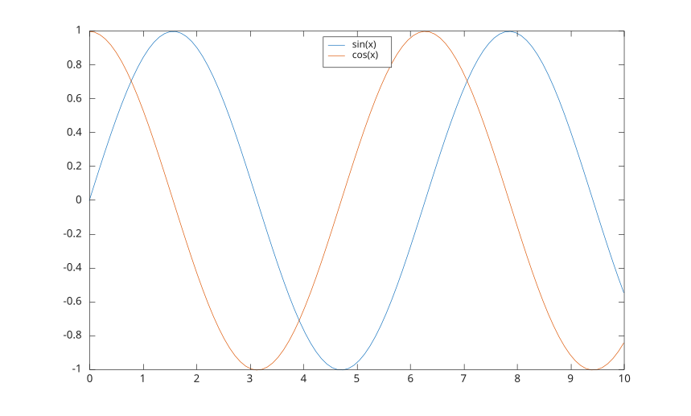

# legend

Add a legend to axes.

## 📝 Syntax

- legend()
- legend(label1, ..., labelN)
- legend(labels)
- legend(plotHandles, labels)
- legend('off')
- legend('hide')
- legend('show')
- legend('toggle')
- legend('boxon')
- legend('boxoff')
- legend(ax, ...)
- legend(ax, plotHandles, labels)
- legend(..., 'Location', lcn)
- legend(..., propertyName, propertyValue)
- L = legend(...)
- [L, icons, plots, text] = legend(...)

## 📥 Input argument

- label1, ..., labelN - sets the legend labels: character vectors or string scalars.
- labels - cell array of character vectors or string array.
- plotHandles - graphics objects to include in the legend.
- 'off' - delete the legend.
- 'toggle' - toggle legend visibility.
- 'hide' - hide the legend.
- 'show' - show the legend.
- 'boxon' - display the box around the legend.
- 'boxoff' - hide the box around the legend.
- ax - target axes or polar axes.
- lcn - legend location string. The default is 'northeast'.
- propertyName - a scalar string or character vector.
- propertyValue - a value.

## 📤 Output argument

- L - a legend graphics object.
- icons - graphics object vector reserved for legend icon objects.
- plots - graphics objects represented by the legend.
- text - graphics object vector reserved for legend text objects.

## 📄 Description


<b>legend</b> creates or updates a legend attached to the target axes. 

When labels are omitted, labels are taken from the <b>DisplayName</b> property of the plotted objects. If <b>AutoUpdate</b> is <b>on</b>, newly added plotted objects are included automatically. 

<b>Location for legend on the plot:</b> 

'northeast' or 'NE': top right (default). 

'north' or 'N': top center. 

'south' or 'S': bottom center. 

'east' or 'E': middle right. 

'west' or 'W': middle left. 

'northwest' or 'NW': top left. 

'southeast' or 'SE': bottom right. 

'southwest' or 'SW': bottom left. 

Outside locations are also supported: 'northoutside', 'southoutside', 'eastoutside', and 'westoutside'. 

See [legend properties](../../../graphics/2_graphics_objects/4_properties/nelson.graphics.legend.properties.md) for the complete property list.

## 💡 Examples


```matlab
f = figure();
x = linspace(0, 10);
y1 = sin(x);
y2 = cos(x);
ax = gca();
plot(ax, x, y1, 'DisplayName', 'sin(x)');
hold(ax, 'on');
plot(ax, x, y2, 'DisplayName', 'cos(x)');
legend(ax, 'Location', 'N')
```



```matlab
f = figure();
x = 1:5;
plot(x, x);
hold on
plot(x, x .^ 2);
lgd = legend({'linear'; 'quadratic'}, 'NumColumns', 2);
title(lgd, 'Curves')
```


## 🔗 See also

[legend properties](../../../graphics/2_graphics_objects/4_properties/nelson.graphics.legend.properties.md), [title](../../../graphics/3_labels_styling/4_labels_annotations/title.md), [text](../../../graphics/3_labels_styling/4_labels_annotations/text.md), [plot](../../../graphics/1_plots/1_line_plots/plot.md).

## 🕔 History

| Version | 📄 Description     |
| ------- | --------------- |
| 1.0.0   | initial version |

<!--
## 👤 Author

Allan CORNET
-->
