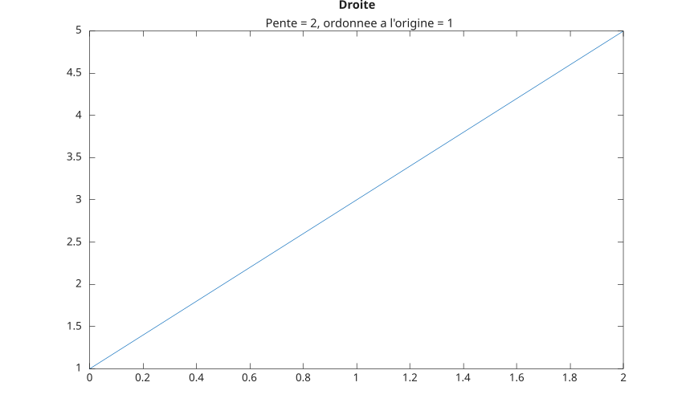

# subtitle

Add subtitle.

## 📝 Syntax

- subtitle(text)
- subtitle(target, text)
- subtitle(..., propertyName, propertyValue)
- go = subtitle(...)

## 📥 Input argument

- text - Text to display: character vector, string scalar, string array, or cell array of character vectors.
- target - An axes or tiled layout graphics object, or an array of objects of the same supported class.
- propertyName - Subtitle object property name.
- propertyValue - Subtitle object property value.

## 📤 Output argument

- go - A subtitle graphics object, or an array of subtitle graphics objects.

## 📄 Description

<b>subtitle</b> adds the subtitle to the current axes or to the specified target.

When the target already has a subtitle text object, <b>subtitle</b> updates and returns that object.

For axes targets, the subtitle text uses data units and follows the axes title horizontal alignment.

For tiled layout targets, the returned object exposes the tiled layout text properties.

String arrays and cell arrays of character vectors are stored as multiple subtitle lines.

Property name and value pairs are applied to the subtitle object.

The <b>Visible</b> property is inherited from the parent axes when a new subtitle text object is created.

## 💡 Examples

Add a subtitle to a plot.

```matlab
f = figure();
plot([0 2], [1 5]);
title('Straight Line');
subtitle('Slope = 2, y-Intercept = 1');
```


Set subtitle properties.

```matlab
f = figure();
plot([0 2], [1 5]);
title('Straight Line');
subtitle('Slope = 2, y-Intercept = 1', 'Color', 'red');
```

## 🔗 See also

[title](../../../graphics/3_labels_styling/4_labels_annotations/title.md), [text](../../../graphics/3_labels_styling/4_labels_annotations/text.md), [tiledlayout](../../../graphics/2_graphics_objects/2_layout_objects/tiledlayout.md).

## 🕔 History

| Version | 📄 Description  |
| ------- | --------------- |
| 2.0.0   | initial version |

<!--
## 👤 Author

Allan CORNET
-->
