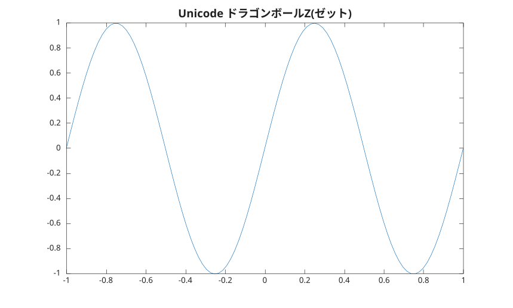

# title

Add title.

## 📝 Syntax

- title(text)
- title(ax, text)
- title(..., propertyName, propertyValue)
- go = title(...)

## 📥 Input argument

- text - Text to display: character vector, string scalar, string array or cell array.
- ax - a scalar graphics object value: parent container, specified as a axes.
- propertyName - a scalar string or row vector character.
- propertyValue - a value.

## 📤 Output argument

- go - a graphics object: text type.

## 📄 Description


<b>title('text')</b> adds the title to the current axes. 

<b>Visible</b> property is inherited from the parent if not explicitly defined.

## 💡 Example


```matlab
f = figure();
x = linspace(-1, 1);
y = sin(2*pi*x);
plot(x, y);
title('Unicode ドラゴンボールZ(ゼット)', 'FontSize', 14);
```



## 🔗 See also

[text](../../../graphics/3_labels_styling/4_labels_annotations/text.md), [xlabel](../../../graphics/3_labels_styling/4_labels_annotations/xlabel.md).

## 🕔 History

| Version | 📄 Description     |
| ------- | --------------- |
| 1.0.0   | initial version |
| 1.10.0   | Visible property is inherited from the parent if not explicitly defined. |

<!--
## 👤 Author

Allan CORNET
-->
