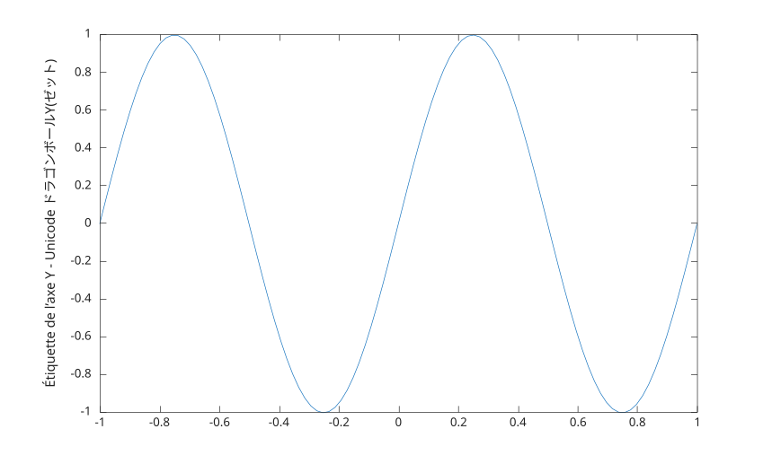

# ylabel

Label y-axis.

## 📝 Syntax

- ylabel(text)
- ylabel(ax, text)
- ylabel(..., propertyName, propertyValue)
- go = ylabel(...)

## 📥 Input argument

- text - Text to display: character vector, string scalar, string array or cell array.
- ax - a scalar graphics object value: parent container, specified as a axes.
- propertyName - a scalar string or row vector character.
- propertyValue - a value.

## 📤 Output argument

- go - a graphics object: text type.

## 📄 Description


<b>ylabel('text')</b> labels the y-axis of the current axes.

## 💡 Example


```matlab
f = figure();
x = linspace(-1, 1);
y = sin(2*pi*x);
plot(x, y);
ylabel('Y axis Label - Unicode ドラゴンボールY(ゼット)')
```



## 🔗 See also

[text](../../../graphics/3_labels_styling/4_labels_annotations/text.md), [title](../../../graphics/3_labels_styling/4_labels_annotations/title.md).

## 🕔 History

| Version | 📄 Description     |
| ------- | --------------- |
| 1.0.0   | initial version |

<!--
## 👤 Author

Allan CORNET
-->
