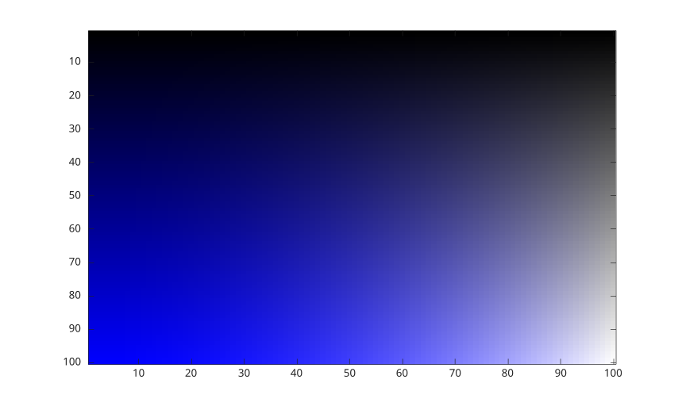
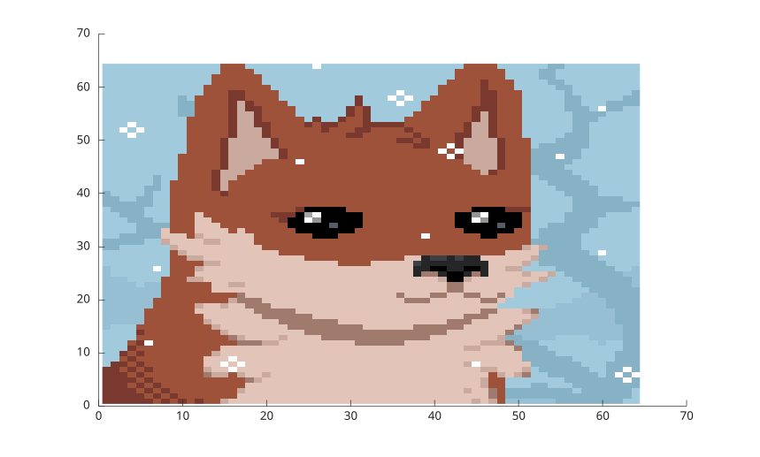

# image

Display image from array.

## 📝 Syntax

- image()
- image(C)
- image(X, Y, C)
- image('CData', C)
- image('XData', X, 'YData', Y,'CData', C)
- image(..., propertyName, propertyValue)
- image(parent, ...)
- go = image(...)

## 📥 Input argument

- X - x-coordinates: vector or matrix.
- Y - y-coordinates: vector or matrix.
- C - Color array: m-by-n-by-3 array of RGB triplets.
- parent - a scalar graphics object value: parent container, specified as a axes.
- propertyName - a scalar string or row vector character.
- propertyValue - a value.

## 📤 Output argument

- go - a graphics object: image type.

## 📄 Description

<b>image</b> displays C data as an image.

See [image properties](../../graphics/2_graphics_objects/4_properties/nelson.graphics.image.properties.md) for the complete property list.

## 💡 Examples

```matlab
f = figure();
L = linspace(0, 1);
R = L' * L;
G = L' * (L .^ 2);
B = L' * (0 *L + 1);
C(:, :, 1) = G;
C(:, :, 2) = G;
C(:, :, 3) = B;
im = image(C)
```



```matlab
f = figure();
image();
```



## 🔗 See also

[image properties](../../graphics/2_graphics_objects/4_properties/nelson.graphics.image.properties.md), [imagesc](../../graphics/4_images/imagesc.md), [colormap](../../graphics/3_labels_styling/2_color_styling/colormaps/colormap.md).

## 🕔 History

| Version | 📄 Description                       |
| ------- | ------------------------------------ |
| 1.0.0   | initial version                      |
| 1.7.0   | CreateFcn, DeleteFcn callback added. |
| --      | BeingDeleted property added.         |

<!--
## 👤 Author

Allan CORNET
-->
