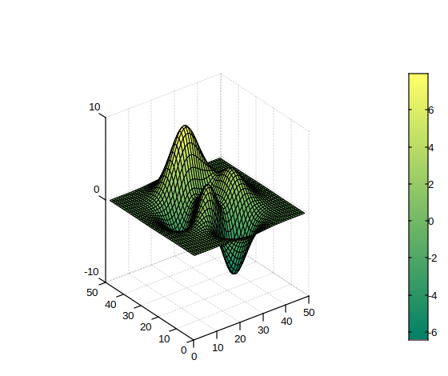
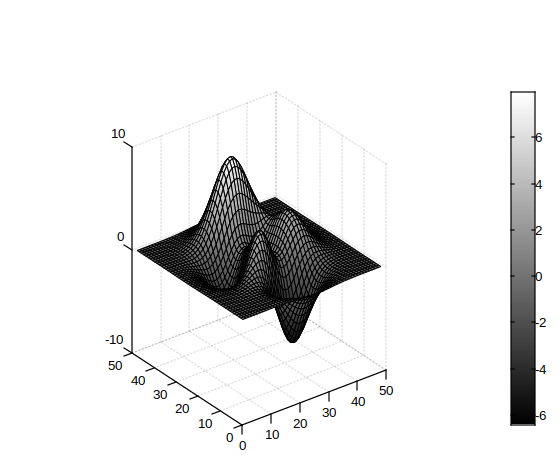

# colorbar

Colorbar showing color scale.

## 📝 Syntax

- colorbar()
- colorbar('off')
- colorbar(location)
- colorbar(..., propertyName, propertyValue)
- colorbar(target, ...)
- colorbar(target, 'off')
- c = colorbar(...)

## 📥 Input argument

- propertyName - a scalar string or row vector character.
- propertyValue - a value.
- target - Target: axes.
- 'off' - deletes colorbar associated with the current axes.
- location - location of the colorbar (e.g. 'north','south','east','west', ...).

## 📤 Output argument

- c - graphics object: axes on color bar.

## 📄 Description

<b>colorbar</b> adds a color bar into a plot.

It can be placed at different locations around the axes.

Supported locations include: 'north','south','east','west', 'northoutside','southoutside','eastoutside','westoutside'.

## 💡 Examples

```matlab
f = figure();
surf(peaks);
axis('square');
colormap('summer');
colorbar()

```



```matlab
f = figure();
surf(peaks);
axis('square');
colormap('gray');
cb = colorbar(gca);
```



```matlab
locations = { 'north';
'south';
'east';
'west';
'northoutside';
'southoutside';
'eastoutside';
'westoutside'};
f = figure();
surf(peaks);
colormap('jet');
for k = 1 : length(locations)
    colorbar(locations{k});
    pause(1);
end

```

## 🔗 See also

[colormap](../graphics/colormap/colormap.md).

## 🕔 History

| Version | 📄 Description                       |
| ------- | ------------------------------------ |
| 1.0.0   | initial version                      |
| 1.15.0  | added support for location parameter |

<!--
## 👤 Author

Allan CORNET
-->
