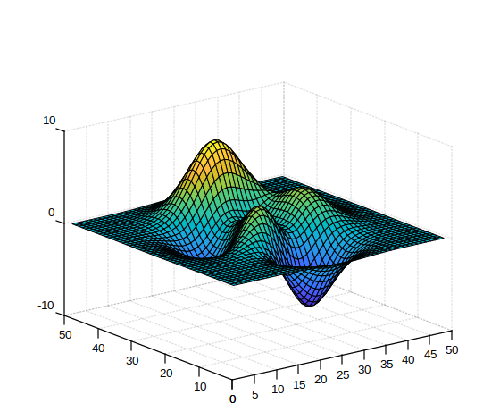

# parula

Parula colormap array.

## 📝 Syntax

- c = parula
- c = parula(m)

## 📥 Input argument

- m - a scalar integer value: Number of colors (256 as default value).

## 📤 Output argument

- c - Parula colormap array.

## 📄 Description

<b>parula</b> returns the colormap with parula colors.

<b>parula</b> is the default colormap.

## 💡 Example

```matlab
f = figure();
surf(peaks);
colormap('parula');
```



## 🔗 See also

[colormap](../../graphics/colormap/colormap.md).

## 🕔 History

| Version | 📄 Description  |
| ------- | --------------- |
| 1.0.0   | initial version |

<!--
## 👤 Author

Allan CORNET
-->
