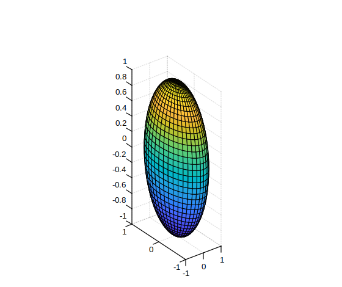

# daspect

Control data unit length along each axis.

## 📝 Syntax

- daspect(ratio)
- d = daspect()
- daspect('auto')
- daspect('manual')
- m = daspect('mode')
- daspect(ax, ...)

## 📥 Input argument

- ratio - Three-element vector of positive values specifying the relative lengths of data units along the x, y, and z axes.
- 'auto' - Set the data aspect ratio mode to automatic.
- 'manual' - Set the data aspect ratio mode to manual.
- 'mode' - Query the current data aspect ratio mode ('auto' or 'manual').
- ax - Target axes object. If not specified, uses current axes.

## 📤 Output argument

- d - Three-element vector representing the current data aspect ratio.
- m - Current data aspect ratio mode: 'auto' or 'manual'.

## 📄 Description

<b>daspect</b> controls the relative lengths of data units along the x, y, and z axes.

<b>daspect(ratio)</b> sets the data aspect ratio for the current axes. <b>ratio</b> is a three-element vector of positive values. For example, [1 2 3] means the length from 0 to 1 along the x-axis equals the length from 0 to 2 along the y-axis and 0 to 3 along the z-axis.

<b>d = daspect()</b> returns the current data aspect ratio as a three-element vector.

<b>daspect('auto')</b> sets the data aspect ratio mode to automatic, enabling the axes to choose the ratio.

<b>daspect('manual')</b> sets the mode to manual and uses the ratio stored in the axes.

<b>m = daspect('mode')</b> returns the current mode, either 'auto' or 'manual'.

<b>daspect(ax, ...)</b> operates on the axes specified by <b>ax</b> instead of the current axes.

Setting the data aspect ratio disables the stretch-to-fill behavior of the axes.

## 💡 Examples

stretch X relative to Y

```matlab

plot(-5:5, (-5:5).^2)
daspect([2 1 1])
```


Set different data unit lengths for each axis

```matlab

sphere(40);
daspect([2 1 0.5])

```


Switch between manual and auto aspect ratio modes

```matlab

[X, Y, Z] = sphere(30);
surf(X, Y, Z)
daspect([2 1 1])
disp(daspect('mode'))
daspect('auto')
disp(daspect('mode'))

```


Query the current data aspect ratio

```matlab

[x, y] = meshgrid(-2:0.2:2);
z = x .* exp(-x.^2 - y.^2);
surf(x, y, z)
d = daspect()
disp(d)

```


## 🔗 See also

[pbaspect](../graphics/pbaspect.md), [axis](../graphics/axis.md), [xlim](../graphics/xlim.md), [ylim](../graphics/ylim.md), [zlim](../graphics/zlim.md).

## 🕔 History

| Version | 📄 Description  |
| ------- | --------------- |
| 1.16.0  | initial version |

<!--
## 👤 Author

Allan CORNET
-->
