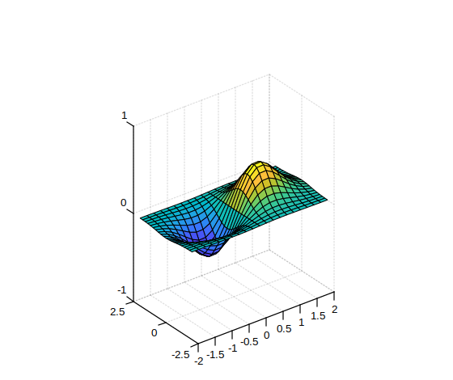
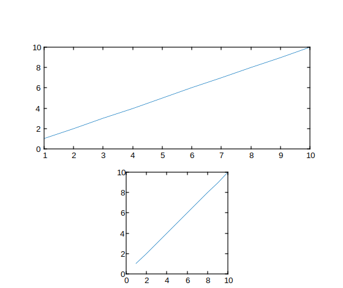

# pbaspect

Control relative lengths of each axis in the plot box.

## 📝 Syntax

- pbaspect(ratio)
- pb = pbaspect()
- pbaspect('auto')
- pbaspect('manual')
- m = pbaspect('mode')
- pbaspect(ax, ...)

## 📥 Input argument

- ratio -

Three-element vector of positive values specifying the relative lengths of the x, y, and z axes in the plot box.

- 'auto' -

Set the plot box aspect ratio mode to automatic.

- 'manual' -

Set the plot box aspect ratio mode to manual.

- 'mode' -

Query the current plot box aspect ratio mode ('auto' or 'manual').

- ax -

Target axes object. If not specified, uses current axes.

## 📤 Output argument

- pb -

Three-element vector representing the current plot box aspect ratio.

- m -

Current plot box aspect ratio mode: 'auto' or 'manual'.

## 📄 Description

<b>pbaspect</b> controls the relative lengths of the x, y, and z axes in the plot box.

<b>pbaspect(ratio)</b> sets the plot box aspect ratio for the current axes. <b>ratio</b> is a three-element vector of positive values. For example, [3 1 1] means the x-axis is three times as long as the y- and z-axes.

<b>pb = pbaspect()</b> returns the current plot box aspect ratio as a three-element vector.

<b>pbaspect('auto')</b> sets the plot box aspect ratio mode to automatic, enabling the axes to choose the ratio.

<b>pbaspect('manual')</b> sets the mode to manual and uses the ratio stored in the axes.

<b>m = pbaspect('mode')</b> returns the current mode, either 'auto' or 'manual'.

<b>pbaspect(ax, ...)</b> operates on the axes specified by <b>ax</b> instead of the current axes.

Setting the plot box aspect ratio disables the stretch-to-fill behavior of the axes.

## 💡 Examples

Use equal axis lengths

```matlab

x = linspace(0,10,100);
y = sin(x);
plot(x, y)
pbaspect([1 1 1])

```


Use different axis lengths

```matlab

[x, y] = meshgrid(-2:0.2:2);
z = x .* exp(-x.^2 - y.^2);
surf(x, y, z)
pbaspect([2 1 1])
disp(pbaspect('mode'))

```


Revert back to default plot box aspect ratio

```matlab

X = rand(100,1);
Y = rand(100,1);
Z = rand(100,1);
scatter3(X, Y, Z)
pbaspect([3 2 1])
pbaspect('auto')

```


Query plot box aspect ratio

```matlab

[x, y] = meshgrid(-2:0.2:2);
z = x .* exp(-x.^2 - y.^2);
surf(x, y, z)
pb = pbaspect()
disp(pb)

```


Set plot box aspect ratio for specific axes object

```matlab

f = figure();
ax1 = subplot(2, 1, 1);
plot(ax1, 1:10)
ax2 = subplot(2, 1, 2);
plot(ax2, 1:10)
pbaspect(ax2, [2 2 1])

```



## 🔗 See also

[daspect](../graphics/daspect.md), [axis](../graphics/axis.md), [xlim](../graphics/xlim.md), [ylim](../graphics/ylim.md), [zlim](../graphics/zlim.md).

## 🕔 History

| Version | 📄 Description  |
| ------- | --------------- |
| 1.16.0  | initial version |

<!--
## 👤 Author

Allan CORNET
-->
