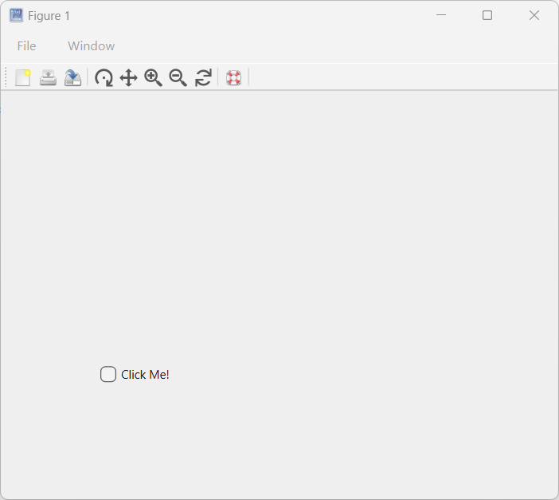
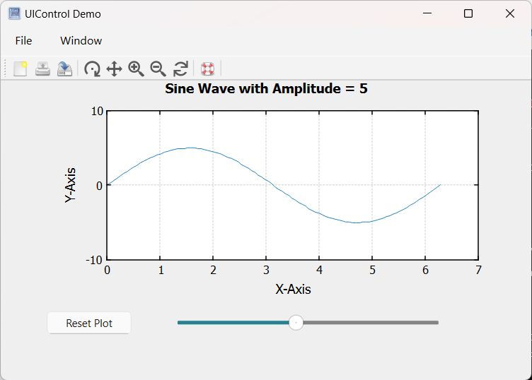

# uicontrol

Create user interface component.

## Syntax

- c = uicontrol()
- c = uicontrol(propertyName, propertyValue)
- c = uicontrol(parent)
- c = uicontrol(parent, propertyName, propertyValue, ...)
- uicontrol(c)

## Input argument

- parent - figure graphics object.
- propertyName - property name: a scalar string or row vector character.
- propertyValue - property value: a value compatible with property name.
- c - an User Interface control object.

## Output argument

- c - an User Interface control object.

## Description

  <p><b>c = uicontrol</b> creates a push button, which is the default user interface control, within the current figure and returns the associated uicontrol object. If no figure is currently open, Nelson generates one using the figure function.</p>
  <p><b>c = uicontrol(propertyName, propertyValue)</b> creates a user interface control with properties defined by one or more name-value pair arguments. For instance, specifying 'Style', 'button' will create a button.</p>
  <p><b>c = uicontrol(parent)</b> creates the default user interface control (push button) within the specified parent container, rather than defaulting to the current figure.</p>
  <p><b>c = uicontrol(parent, propertyName, propertyValue)</b> creates a user interface control within the specified parent container, allowing you to define its properties using one or more name-value pair arguments.</p>
  <p><b>uicontrol(c)</b> sets the focus to a previously defined user interface control, bringing it to the forefront for user interaction.</p>
  <p/>
  <p>List of properties:</p>
  <p/>
  <p><b>BackgroundColor</b>: Background color, specified as an RGB triplet, a hexadecimal color code, or a valid color name.</p>
  <p><b>BeingDeleted</b>: Deletion status. on/off logical value.</p>
  <p><b>BusyAction</b>: Callback queuing specified as 'queue' (default) or 'cancel'. The property determines how Nelson handles the execution of interrupting callbacks.</p>
  <p><b>ButtonDownFcn</b>: Button-press callback function</p>
  <p><b>CData</b>:An optional icon can be specified as a 3-D array of truecolor RGB values. The array values can be either:
Double-precision numbers ranging from 0.0 to 1.0, or uint8 numbers ranging from 0 to 255</p>
  <p><b>Callback</b>: Primary callback function: '' (default), function handle, cell array or character vector.</p>
  <p><b>Children</b>: UIControl children: empty array.</p>
  <p><b>CreateFcn</b>: Component creation function.</p>
  <p><b>DeleteFcn</b>: Component deletion function.</p>
  <p><b>Enable</b>: Operational state of user interface control.</p>
  <p><b>FontAngle</b>: Font angle: 'italic' or 'normal' (default).</p>
  <p><b>FontName</b>: Font name: system supported font name.</p>
  <p><b>FontSize</b>: Font size: positive number.</p>
  <p><b>FontUnits</b>: Font units: 'normalized', 'inches', 'centimeters', 'pixels' or 'points' (default).</p>
  <p><b>FontWeight</b>: Font weight: 'bold' or 'normal' (default).</p>
  <p><b>ForeGround</b>: Text color, specified as an RGB triplet, a hexadecimal color code, or valid color name.</p>
  <p><b>HandleVisibility</b>: Visibility of uiControl handle.</p>
  <p><b>HorizontalAlignment</b>: Alignment of uicontrol text 'left', 'right' or 'center' (default).</p>
  <p><b>Interruptible</b>: Callback interruption 'on' (default).</p>
  <p><b>KeyPressFcn</b>: Key press callback function.</p>
  <p><b>KeyReleaseFcn</b>: Key release callback function</p>
  <p><b>ListboxTop</b>: Index of top item in list box: integer value or 1 (default).</p>
  <p><b>Max</b>: Maximum value: number or 1 (default).</p>
  <p><b>Min</b>:  Minimum value: number or 0 (default).</p>
  <p><b>Parent</b>: Parent object: Figure.</p>
  <p><b>Position</b>: Location and size: [left bottom width height].</p>
  <p><b>SliderStep</b>:  Slider step size: [minorstep majorstep] or [0.01 0.10] (default).</p>
  <p><b>String</b>: Text to display: character vector, cell array of character vectors or string array.</p>
  <p><b>Style</b>: 'pushbutton' (default), 'togglebutton', 'checkbox', 'radiobutton', 'edit', 'text', 'slider'.</p>
  <p><b>Tooltip</b>: Tooltip: character vector or string scalar.</p>
  <p><b>Type</b>: 'uicontrol'</p>
  <p><b>Units</b>: Units of measurement: 'pixels' (default), 'normalized', 'centimeters', 'inches' or 'points'.</p>
  <p><b>UserData</b>: User data array or [] (default).</p>
  <p><b>Value</b>: Current value: number</p>
  <p><b>Visible</b>: State of visibility: 'on' (default).</p>

## Examples

Pushbutton

```matlab
f = figure;
b = uicontrol(f,'Style','pushbutton', 'String', 'Click Me', 'Position', [100 100 60 30], 'Callback', 'disp(''Hello World!'')')
```


Checkbox

```matlab
f = figure();
h = uicontrol('Style', 'checkbox', 'String', 'Click Me!', 'Position', [100, 100, 100, 50]);
```



Edit

```matlab
f = figure();
h = uicontrol('Style', 'edit', 'String', 'Click Me!', 'Position', [100, 100, 100, 50]);
```


Image

```matlab
hFig = figure('Position', [100, 100, 300, 300]);
imgSize = 50;  % Size of the image
[X, Y] = meshgrid(1:imgSize, 1:imgSize);
CData = cat(3, X/imgSize, Y/imgSize, zeros(imgSize));
CData = im2double(CData);  % Ensure the image is of type double
hButton = uicontrol('Style', 'pushbutton',  'Position', [100, 100, 100, 100], 'CData', CData, 'String', 'Click Me!');
```


uicontrol demo

```matlab
addpath([modulepath('graphics','root'), '/examples/uicontrol'])
edit uicontrol_demo
uicontrol_demo
```



uicontrol demo Interruptible

```matlab
addpath([modulepath('graphics','root'), '/examples/uicontrol'])
edit uicontrol_demo_interruptible
uicontrol_demo_interruptible
```


## See also

[figure](figure.md), [Managing Callback Interruptions in Nelson](graphical_callback.md).

## History

| Version | Description          |
| ------- | -------------------- |
| 1.7.0   | initial version      |
| 1.14.0  | Units property added |

## Author

Allan CORNET
