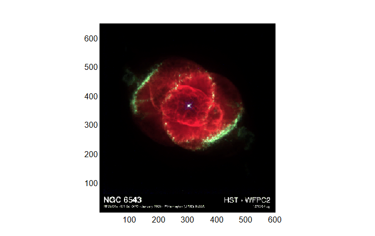

# imread

Read image from graphics file.

## Syntax

- A = imread(filename)
- [A, map] = imread(filename)
- [A, map, transparency] = imread(filename)

## Input argument

- filename - a row vector characters or scalar string: name of graphics file.

## Output argument

- A - Image data: array.
- map - Colormap: m-by-3 matrix.
- transparency - Transparency information: matrix.

## Description

  <p><b>imread</b> reads the image data from the given file into a matrix.</p>
  <p/>
  <table style="width:100%">
    <tr>
      <th>Format</th>
      <th>Description</th>
    </tr>
    <tr>
      <th>BMP</th>
      <th>Windows Bitmap</th>
    </tr>
    <tr>
      <th>GIF</th>
      <th>Graphic Interchange Format (optional)</th>
    </tr>
    <tr>
      <th>JPG</th>
      <th>Joint Photographic Experts Group</th>
    </tr>
    <tr>
      <th>TIFF</th>
      <th>Tagged Image File Format</th>
    </tr>
    <tr>
      <th>JPEG</th>
      <th>Joint Photographic Experts Group</th>
    </tr>
    <tr>
      <th>PCX</th>
      <th>PiCture eXchange</th>
    </tr>
    <tr>
      <th>PNG</th>
      <th>Portable Network Graphics</th>
    </tr>
    <tr>
      <th>PBM</th>
      <th>Portable Bitmap</th>
    </tr>
    <tr>
      <th>PGM</th>
      <th>Portable Graymap</th>
    </tr>
    <tr>
      <th>PPM</th>
      <th>Portable Pixmap</th>
    </tr>
    <tr>
      <th>XBM</th>
      <th>X11 Bitmap</th>
    </tr>
    <tr>
      <th>XPM</th>
      <th>X11 Pixmap</th>
    </tr>
  </table>

## Example

```matlab
f = figure();
filename = [tempdir, 'ngc6543a.gif'];
websave(filename, 'https://solarviews.com/raw/ds/ngc6543a.gif');
img = imread(filename);
imagesc(img);
```



## See also

[imagesc](../graphics/imagesc.md), [imformats](imformats.md).

## History

| Version | Description             |
| ------- | ----------------------- |
| 1.0.0   | initial version         |
| 1.13.0  | pcx, tiff formats added |

## Author

Allan CORNET
