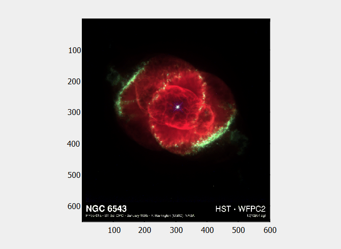

# imread

Read image from graphics file.

## 📝 Syntax

- A = imread(filename)
- [A, map] = imread(filename)
- [A, map, transparency] = imread(filename)

## 📥 Input argument

- filename - a row vector characters or scalar string: name of graphics file.

## 📤 Output argument

- A - Image data: array.
- map - Colormap: m-by-3 matrix.
- transparency - Transparency information: matrix.

## 📄 Description


<b>imread</b> reads the image data from the given file into a matrix. 

The file type is detected from its signature. The extension is used as a fallback for textual or ambiguous formats. For animated GIF files, the first composited frame is returned; for TIFF files, the first page is returned. 

Indexed images return an M-by-N <b>uint8</b> matrix, a K-by-3 double colormap in [0, 1] and, when present, an M-by-N <b>uint8</b> transparency matrix. RGB and RGBA images return an M-by-N-by-3 <b>uint8</b> array; RGBA transparency is returned separately as the third output. Sixteen-bit grayscale PNG, TIFF and PGM images return an M-by-N <b>uint16</b> matrix. 

| Format | Access | 
| --- | --- | 
| BMP/DIB | read | 
| GIF | read, first composited frame | 
| JPEG/JFIF (JPG) | read | 
| TIFF | read, first page | 
| PCX | read | 
| PNG | read | 
| PBM | read | 
| PGM | read | 
| PPM | read | 
| WebP, TGA, PNM | read | 
| PSD, HDR/RGBE, PIC | read only | 


## 💡 Examples


```matlab
f = figure();
filename = [tempname, '.webp'];
imwrite(rand(32, 32, 3), filename, 'Quality', 90);
img = imread(filename);
imagesc(img);
close(f);
```

WebP transparency, indexed PNG and 16-bit grayscale data.

```matlab
source = rand(16, 16, 3);
alphaSource = rand(16, 16);
webpFile = [tempname, '.webp'];
png16File = [tempname, '.png'];
indexedFile = [tempname, '.png'];
imwrite(source, webpFile, 'Alpha', alphaSource);
imwrite(uint16(reshape(0:255, 16, 16) * 257), png16File);
indices = uint8([0 1; 1 0]);
palette = [1 0 0; 0 0 1];
imwrite(indices, palette, indexedFile);
[rgb, map, alpha] = imread(webpFile);
gray16 = imread(png16File);
[X, indexedMap, indexedAlpha] = imread(indexedFile);
```


## 🔗 See also

[imagesc](../graphics/4_images/imagesc.md), [imformats](../graphics_io/imformats.md).

## 🕔 History

| Version | 📄 Description     |
| ------- | --------------- |
| 1.0.0   | initial version |
| 1.13.0   | pcx, tiff formats added |
| 2.0.0   | WebP and deterministic Qt-free codecs added |

<!--
## 👤 Author

Allan CORNET
-->
