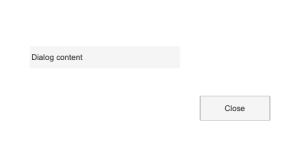

# dialog

Creates a dialog figure window.

## 📝 Syntax

- f = dialog
- f = dialog(Name, Value)

## 📥 Input argument

- Name, Value - Figure property name-value pairs. dialog applies MenuBar = 'none', ToolBar = 'auto', NumberTitle = 'off', Resize = 'off', and WindowStyle = 'modal' before user-supplied properties. Common properties include 'Name', 'Position', 'Visible', 'WindowStyle', 'Resize', and 'CloseRequestFcn'.

## 📤 Output argument

- f - Graphics figure handle.

## 📄 Description

dialog creates a graphics figure configured for dialog content. The returned handle can be used with get, set, close, delete, and waitfor.

## 💡 Examples

Create a dialog with controls.

```matlab
f = dialog('Name', 'Settings', 'WindowStyle', 'normal', 'Position', [100 100 300 150]);
uicontrol(f, 'Style', 'text', 'String', 'Dialog content', 'Position', [30 82 150 22]);
uicontrol(f, 'Style', 'pushbutton', 'String', 'Close', 'Position', [200 30 70 24]);
```


Create a dialog with a title and close it.

```matlab
f = dialog('Name', 'Progress', 'Visible', 'off', 'Position', [300 300 240 100]);
close(f)
```

## 🔗 See also

[msgbox](../gui/msgbox.md), [waitbar](../gui/waitbar.md).

## 🕔 History

| Version | 📄 Description           |
| ------- | ------------------------ |
| 2.0.0   | Updated dialog API help. |

<!--
## 👤 Author

Allan CORNET
-->
