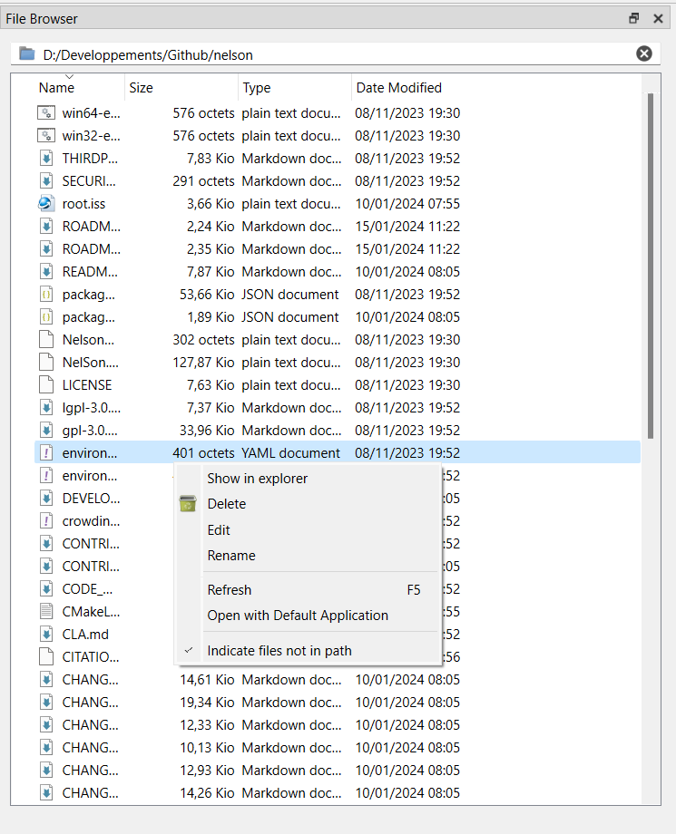

# filebrowser

Current Folder Browser

## 📝 Syntax

- filebrowser

## 📄 Description

The Current Folder browser supports interactive file and folder management. Use it to navigate, create, open, move, and rename files and folders in the current directory. 

## 🔗 See also

[commandhistory](../gui/commandhistory.md), [workspace](../gui/workspace.md).

## 🕔 History

| Version | 📄 Description     |
| ------- | --------------- |
| 1.1.0   | initial version |

<!--
## 👤 Author

Allan CORNET
-->
