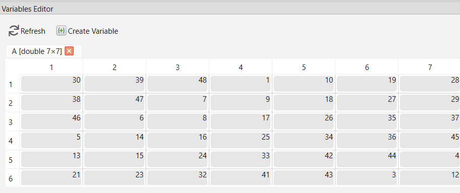

# openvar

Open variable in the Variable Editor

## 📝 Syntax

- openvar(varname)

## 📥 Input argument

- varname: a string or row vector characters - Name of the variable to open. Must exist in the current workspace.

## 📄 Description


<b>openvar(varname)</b> opens the variable named<b>varname</b> in Nelson's Variable Editor for graphical inspection and editing. 

Any changes made to the variable within the editor are immediately applied to the workspace context. 

The Variable Editor supports scalars, vectors, matrices, strings, cell arrays, tables and structures. Multidimensional arrays can be viewed but may have limited edit capabilities. 

You can also open a variable by double-clicking it in the Variables panel. 

The editor synchronizes automatically with the current workspace. 

Editable Content: In structures (struct), cells (cell), and tables (table), only scalar elements can be edited. 

Nelson provides full clipboard integration with spreadsheet applications like <b>Microsoft Excel</b>, <b>LibreOffice Calc</b>, and <b>OpenOffice Calc</b>. 

You can copy variables from the Variable Editor and paste them directly into these applications, and vice versa. 





## 💡 Example


```matlab
A = [1 2 3; 4 5 6]; openvar("A");
```


## 🔗 See also

[workspace](../gui/workspace.md), [filebrowser](../gui/filebrowser.md).

## 🕔 History

| Version | 📄 Description     |
| ------- | --------------- |
| 1.15.0   | initial version |

<!--
## 👤 Author

Allan CORNET
-->
