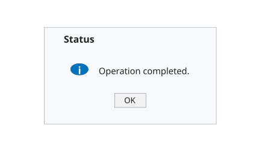

# uialert

Displays an alert dialog for a UI figure.

## 📝 Syntax

- uialert(parent, message, title)
- uialert(parent, message, title, Name, Value)

## 📥 Input argument

- parent - Parent UI figure handle, usually created with uifigure.
- message - Message text displayed in the alert dialog. Use a character vector, string scalar, or cell array of text lines.
- title - Dialog title.
- Name, Value - Optional pairs. The 'Icon' option selects the icon style, such as 'info', 'warning', 'error', or 'question'.

## 📄 Description


uialert displays a modal alert message associated with a UI figure.

## 💡 Examples

Renderable preview for the help image.

```matlab
f = figure('Name', 'Alert preview', 'Position', [100 100 420 260], 'Color', [1 1 1]);
axis([0 1 0 1]); axis off; hold on;
patch([0.06 0.94 0.94 0.06], [0.12 0.12 0.88 0.88], [0.97 0.98 0.99], 'EdgeColor', [0.62 0.65 0.68]);

text(0.16, 0.78, 'Status', 'FontSize', 12, 'FontWeight', 'bold');
t = linspace(0, 2*pi, 50); patch(0.24 + 0.045*cos(t), 0.55 + 0.045*sin(t), [0.00 0.45 0.74], 'EdgeColor', [0.00 0.35 0.60]);
text(0.24, 0.535, 'i', 'HorizontalAlignment', 'center', 'FontSize', 13, 'FontWeight', 'bold', 'Color', [1 1 1]);
text(0.34, 0.54, 'Operation completed.', 'FontSize', 11);
patch([0.42 0.58 0.58 0.42], [0.25 0.25 0.36 0.36], [0.95 0.95 0.95], 'EdgeColor', [0.55 0.55 0.55]);
text(0.50, 0.30, 'OK', 'HorizontalAlignment', 'center', 'FontSize', 10);
```

Display a warning alert.

```matlab
f = uifigure('Visible', 'off', 'Name', 'Import');
uialert(f, 'No file was selected.', 'Import', 'Icon', 'warning');
close(f)
```


## 🔗 See also

[uiconfirm](../gui/uiconfirm.md), [uiprogressdlg](../gui/uiprogressdlg.md).

## 🕔 History

| Version | 📄 Description     |
| ------- | --------------- |
| 2.0.0   | Updated dialog API help. |

<!--
## 👤 Author

Allan CORNET
-->
