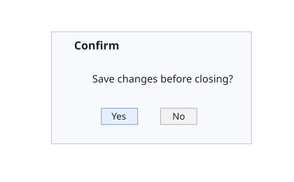

# uiconfirm

Displays a confirmation dialog for a UI figure.

## 📝 Syntax

- selection = uiconfirm(parent, message, title)
- selection = uiconfirm(parent, message, title, Name, Value)

## 📥 Input argument

- parent - Parent UI figure handle, usually created with uifigure.
- message - Question text displayed in the confirmation dialog.
- title - Dialog title.
- Name, Value - Optional pairs. 'Options' defines the button labels. 'DefaultOption' defines the initially selected option.

## 📤 Output argument

- selection - Text of the selected option, or an empty character vector when dismissed.

## 📄 Description

uiconfirm displays a confirmation dialog and returns the selected button text.

## 💡 Examples

Renderable preview for the help image.

```matlab
f = figure('Name', 'Confirm preview', 'Position', [100 100 420 260], 'Color', [1 1 1]);
axis([0 1 0 1]); axis off; hold on;
patch([0.06 0.94 0.94 0.06], [0.12 0.12 0.88 0.88], [0.97 0.98 0.99], 'EdgeColor', [0.62 0.65 0.68]);

text(0.16, 0.78, 'Confirm', 'FontSize', 12, 'FontWeight', 'bold');
text(0.24, 0.56, 'Save changes before closing?', 'FontSize', 11);
patch([0.28 0.44 0.44 0.28], [0.25 0.25 0.36 0.36], [0.90 0.94 1.00], 'EdgeColor', [0.25 0.45 0.75]);
patch([0.54 0.70 0.70 0.54], [0.25 0.25 0.36 0.36], [0.95 0.95 0.95], 'EdgeColor', [0.55 0.55 0.55]);
text(0.36, 0.30, 'Yes', 'HorizontalAlignment', 'center', 'FontSize', 10);
text(0.62, 0.30, 'No', 'HorizontalAlignment', 'center', 'FontSize', 10);
```


Ask a basic confirmation question.

```matlab
f = uifigure('Visible', 'off', 'Name', 'Close');
answer = uiconfirm(f, 'Close the window?', 'Confirm');
close(f);
disp(answer)
```

## 🔗 See also

[uialert](../gui/uialert.md), [questdlg](../gui/questdlg.md).

## 🕔 History

| Version | 📄 Description           |
| ------- | ------------------------ |
| 2.0.0   | Updated dialog API help. |

<!--
## 👤 Author

Allan CORNET
-->
