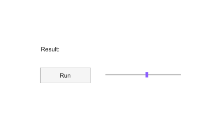

# uifigure

Create a figure for app-style user interfaces.

## 📝 Syntax

- f = uifigure()
- f = uifigure(Name, Value)

## 📥 Input argument

- Name, Value - Figure property name-value pairs. uifigure applies MenuBar = 'none', ToolBar = 'none', NumberTitle = 'off', Resize = 'on', WindowStyle = 'normal', and a default 560-by-420 pixel size before user-supplied properties.

## 📤 Output argument

- f - Graphics figure handle.

## 📄 Description

uifigure creates a graphics figure configured for interface-oriented dialogs and controls. The returned handle can be used with get, set, close, delete, and as the parent for UI dialog functions.

Supported properties are the figure properties available in Nelson, including 'Name', 'Position', 'Visible', 'WindowStyle', 'Resize', 'Color', 'Tag', and callback properties.

## 💡 Examples

Captured UI figure for the help image.

```matlab
f = uifigure('Visible', 'off', 'Name', 'Results', 'Position', [100 100 420 260]);
uilabel(f, 'Text', 'Result:', 'Position', [80 150 90 24]);
uibutton(f, 'Text', 'Run', 'Position', [80 95 100 30]);
uislider(f, 'Position', [210 110 150 3], 'Value', 55);
drawnow();
```


Create a named modal UI figure.

```matlab
f = uifigure('Name', 'Results', 'WindowStyle', 'modal');
f.Name
close(f)
```

## 🔗 See also

[dialog](../gui/dialog.md), [uialert](../gui/uialert.md), [uiconfirm](../gui/uiconfirm.md).

## 🕔 History

| Version | 📄 Description                  |
| ------- | ------------------------------- |
| 2.0.0   | Introduced app-style UI figure. |

<!--
## 👤 Author

Allan CORNET
-->
