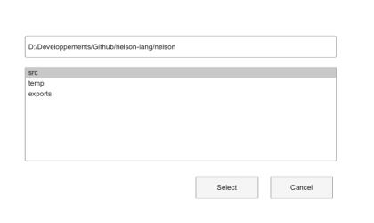

# uigetdir

Opens a directory selection dialog box.

## 📝 Syntax

- path = uigetdir
- path = uigetdir(startPath)
- path = uigetdir(startPath, title)

## 📥 Input argument

- startPath - Initial directory. If the path is not a directory, the current folder is used.

## 📤 Output argument

- path - Selected directory, or 0 when canceled.

## 📄 Description


uigetdir lets the user choose a directory.

## 💡 Examples

Preview a folder selection dialog layout.

```matlab
f = dialog('Name', 'Select a folder', 'WindowStyle', 'normal', 'Position', [100 100 420 250]);
uicontrol(f, 'Style', 'edit', 'String', pwd(), 'Position', [28 186 350 24]);
uicontrol(f, 'Style', 'listbox', 'String', {'src', 'temp', 'exports'}, 'Value', 2, 'Position', [28 70 350 105]);
uicontrol(f, 'Style', 'pushbutton', 'String', 'Select', 'Position', [220 28 70 24]);
uicontrol(f, 'Style', 'pushbutton', 'String', 'Cancel', 'Position', [304 28 70 24]);
```

Start directory selection in the temporary folder.

```matlab
path = uigetdir(tempdir(), 'Select temporary folder');
if ~isequal(path, 0), disp(path); end
```


## 🔗 See also

[uigetfile](../gui/uigetfile.md), [uiputfile](../gui/uiputfile.md).

## 🕔 History

| Version | 📄 Description     |
| ------- | --------------- |
| 2.0.0   | Updated dialog API help. |

<!--
## 👤 Author

Allan CORNET
-->
