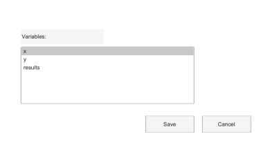

# uisave

Saves workspace variables to a file selected from a dialog box.

## 📝 Syntax

- uisave
- uisave(variables)
- uisave(variables, file)

## 📥 Input argument

- variables - Variable name, string array, or cell array of variable names. If omitted, the workspace is saved.

## 📄 Description

uisave asks for a destination file and saves variables from the caller workspace using the existing save behavior.

## 💡 Examples

Preview a variable save dialog layout.

```matlab
f = dialog('Name', 'Save Variables', 'WindowStyle', 'normal', 'Position', [100 100 400 220]);
uicontrol(f, 'Style', 'text', 'String', 'Variables:', 'Position', [30 156 120 22]);
uicontrol(f, 'Style', 'listbox', 'String', {'x', 'y', 'results'}, 'Value', 1, 'Position', [30 70 250 82]);
uicontrol(f, 'Style', 'pushbutton', 'String', 'Save', 'Position', [210 28 70 24]);
uicontrol(f, 'Style', 'pushbutton', 'String', 'Cancel', 'Position', [292 28 70 24]);
```


Save several named variables.

```matlab
x = 1:5;
y = x .^ 2;
uisave({'x', 'y'}, 'series.nh5')
```

## 🔗 See also

[uiopen](../gui/uiopen.md), [uiputfile](../gui/uiputfile.md).

## 🕔 History

| Version | 📄 Description           |
| ------- | ------------------------ |
| 2.0.0   | Updated dialog API help. |

<!--
## 👤 Author

Allan CORNET
-->
