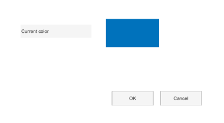

# uisetcolor

Opens a color selection dialog box.

## 📝 Syntax

- c = uisetcolor
- c = uisetcolor(initialColor)
- c = uisetcolor(initialColor, title)

## 📥 Input argument

- initialColor - Initial RGB color vector with values between 0 and 1. If omitted, white is used.

## 📤 Output argument

- c - Selected 1-by-3 RGB color vector, or 0 when canceled.

## 📄 Description


uisetcolor returns a color selected by the user.

## 💡 Examples

Preview a color selection dialog layout.

```matlab
f = dialog('Name', 'Choose color', 'WindowStyle', 'normal', 'Position', [100 100 380 210]);
uicontrol(f, 'Style', 'text', 'String', 'Current color', 'Position', [35 146 120 22]);
uicontrol(f, 'Style', 'text', 'String', ' ', 'BackgroundColor', [0 0.45 0.74], 'Position', [180 130 90 48]);
uicontrol(f, 'Style', 'pushbutton', 'String', 'OK', 'Position', [190 30 70 24]);
uicontrol(f, 'Style', 'pushbutton', 'String', 'Cancel', 'Position', [272 30 70 24]);
```

Choose a color with a custom title.

```matlab
c = uisetcolor([1 0 0], 'Choose highlight color');
if ~isequal(c, 0), disp(c); end
```


## 🔗 See also

[uisetfont](../gui/uisetfont.md).

## 🕔 History

| Version | 📄 Description     |
| ------- | --------------- |
| 2.0.0   | Updated dialog API help. |

<!--
## 👤 Author

Allan CORNET
-->
