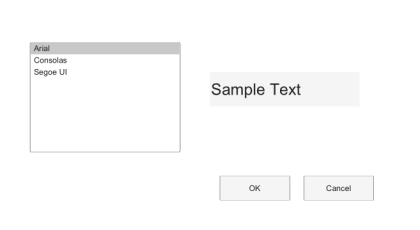

# uisetfont

Opens a font selection dialog box.

## 📝 Syntax

- s = uisetfont
- s = uisetfont(initialFont)
- s = uisetfont(initialFont, title)

## 📥 Input argument

- initialFont - Structure with fields such as FontName and FontSize.

## 📤 Output argument

- s - Structure with fields FontName, FontSize, FontWeight, FontAngle, and FontUnits, or 0 when canceled.

## 📄 Description


uisetfont returns font properties selected by the user.

## 💡 Examples

Preview a font selection dialog layout.

```matlab
f = dialog('Name', 'Choose font', 'WindowStyle', 'normal', 'Position', [100 100 420 230]);
uicontrol(f, 'Style', 'listbox', 'String', {'Arial', 'Consolas', 'Segoe UI'}, 'Value', 2, 'Position', [30 78 150 110]);
uicontrol(f, 'Style', 'text', 'String', 'Sample Text', 'FontName', 'Consolas', 'FontSize', 16, 'Position', [210 124 150 34]);
uicontrol(f, 'Style', 'pushbutton', 'String', 'OK', 'Position', [220 30 70 24]);
uicontrol(f, 'Style', 'pushbutton', 'String', 'Cancel', 'Position', [304 30 70 24]);
```

Choose a font with a custom title.

```matlab
initial.FontName = 'Consolas';
initial.FontSize = 10;
s = uisetfont(initial, 'Choose editor font');
if ~isequal(s, 0), disp(s.FontSize); end
```


## 🔗 See also

[uisetcolor](../gui/uisetcolor.md).

## 🕔 History

| Version | 📄 Description     |
| ------- | --------------- |
| 2.0.0   | Updated dialog API help. |

<!--
## 👤 Author

Allan CORNET
-->
