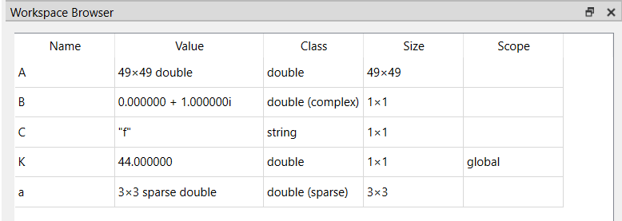

# workspace

Workspace Browser

## Syntax

- workspace

## Description

  
The Workspace browser allows you to observe and actively oversee the contents of the workspace within Nelson, providing access and control over each variable or object present.

  

    
  

## See also

[commandhistory](commandhistory.md), [filebrowser](filebrowser.md).

## History

| Version | Description     |
| ------- | --------------- |
| 1.1.0   | initial version |

## Author

Allan CORNET
