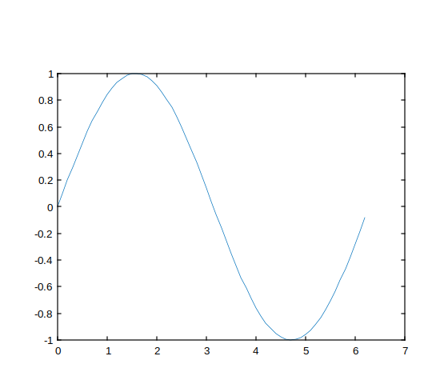

# nelson help reference

How to write help XML files for Nelson (elements, attributes, examples, tips).

This document is the canonical authoring reference for help XML files used by Nelson. It explains the structure required by<code>nelson_help.xsd</code>and how<code>nelson_html.xslt</code>transforms each element into HTML. Use this file as a template and checklist when creating or reviewing documentation pages.

## 📝 Syntax

- `<xmldoc>` (root) — REQUIRED child: `<language>`
- Header: `<title>`, `<language>`, `<module\_name>`, `<chapter>`, `<short\_description>`
- Sections: `<syntax>`, `<param\_input>`, `<param\_output>`, `<description>`, `<examples>`, `<see\_also>`, `<history>`, `<authors>`, `<bibliography>`

## 📥 Input argument

- language -

Locale used by the XSLT to select labels and localized text. Examples:<code>en_US</code>,<code>fr_FR</code>. This element is required on the root<code>`<xmldoc>`</code>.

- keyword -

Main identifier shown as the page title by the XSLT. If absent, the XSLT falls back to<code>`<chapter>`</code>or "Documentation".

## 📤 Output argument

- html -

The XSLT generates an HTML file using local assets:<code>highlight.css</code>,<code>nelson_common.css</code>and<code>nelson_help.js</code>. Images are copied via the extension<code>ext:copy_img</code>.

## 📄 Description

A human-readable reference and definitive example set describing the XML help file format defined by<code>nelson_help.xsd</code>, and how<code>nelson_html.xslt</code>transforms its elements into HTML.

Use<code>`<description>`</code>to provide the main documentation body. It accepts paragraphs (<code>`<p>`</code>), lists (<code>`<ul>`</code>,<code>`<ol>`</code>), tables (<code>`<table>`</code>), inline markup (<code>`<b>`</code>,<code>`<i>`</code>,<code>`<code>`</code>), images (<code>``</code>) and LaTeX (<code>`<latex>`</code>).

Inline elements and their XSLT rendering:

- <b>`<b>`</b> — bold text.
- <b>`<i>`</b> — italic text.
- <b>`<code>`</b> — inline code rendering.
- **`<a href="...">`** — external links (rendered as HTML anchors).
- **`<link linkend="...">`** — internal cross reference. If linkend contains a module in braces<code>{module}name</code>it becomes<code>../module/name.html</code>, otherwise<code>name.html</code>.
- <b>`<latex>`</b> — math expressions; rendered as MathJax display math by the XSLT template (wrapped with<code>`$$...$$`</code>).
- <b>``</b> — images. XSLT calls<code>ext:copy_img(@src)</code>; SVGs are rendered with a large fixed frame and other formats are responsive.

Block elements:

- <code>`<ul>`</code>and<code>`<ol>`</code>— lists. Use<code>`<li>`</code>with nested inline/block markup as needed.
- <code>`<table>`</code>— use<code>`<thead>`</code>,<code>`<tbody>`</code>,<code>`<tr>`</code>,<code>`<th>`</code>and<code>`<td>`</code>. The XSD allows common attributes<code>border</code>,<code>cellpadding</code>and<code>cellspacing</code>.

Authoring tips: 2. Prefer short summary lines for<code>`<short_description>`</code>. 4. Place runnable examples inside<code>`<examples>`</code>using<code>`<example_item_data>`</code>and set<code>`runnable="cli"`</code>if applicable or<code>`runnable="false"`</code>(default). 6. Wrap example source in CDATA to avoid escaping (see examples below). 8. Use `<link linkend="{module}name">` for module-qualified references; otherwise use plain names.

<b>Subchapter support</b> — Nelson's help system supports nested subchapters. To add one: 2. Create a subdirectory under your module help XML folder (for example <code>plots</code>). 4. In that directory add a `chapter.xml` file containing at least <code>`<language>`</code> and <code>`<chapter>`</code>, and an optional <code>`<chapter_description>`</code>. 6. Place topic XML files (for example <code>mesh.xml</code>) inside the subdirectory; topic files use the usual elements such as <code>`<keyword>`</code> and <code>`<short_description>`</code>. 8. Link to nested pages using slash-separated paths: same-module links use `<link linkend="plots/mesh">mesh</link>`, cross-module links use `<link linkend="{module}plots/mesh">mesh</link>`.

The <code>buildhelp</code> tool and XSLT resolve these paths and will generate nested HTML pages (for example <code>plots/mesh.html</code>).

## 📚 Bibliography

https://github.com/nelson-lang/nelson/blob/master/modules/help_tools/help/en_US/xml/1_nelson_help_reference.xml

## 💡 Examples

Minimal runnable example

```matlab

% Simple one-line example
x = rand(1,10);
[y, info] = myfunc(x);
disp(info);

```

Subchapter example (chapter.xml)

```matlab
<?xml version="1.0" encoding="UTF-8"?>
<xmldoc>
  <language>en_US</language>
  <chapter>Plots</chapter>
  <chapter_description>
    <p>Plotting functions grouped in a subchapter.</p>
  </chapter_description>
</xmldoc>

```

Example with image output

```matlab

% Generate a plot and save as SVG
x = 0:0.1:2*pi;
y = sin(x);
plot(x,y);
saveas(gcf(), [tempdir(),'example_plot.svg']);

```



## 🔗 See also

[doc](../help_tools/doc.md), [plot (graphics module)](../graphics/plot.md).

## 🕔 History

| Version | 📄 Description           |
| ------- | ------------------------ |
| 1.15.0  | initial version          |
| 1.17.0  | added subchapter support |

<!--
## 👤 Author

Allan CORNET
-->
