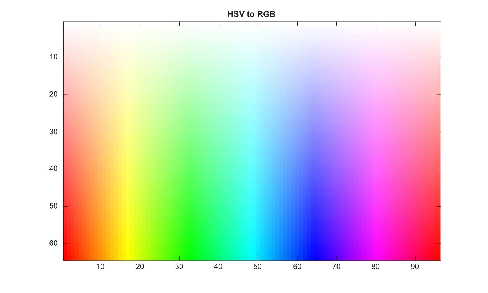

# hsv2rgb

Convert HSV color values to RGB color values.

## 📝 Syntax

- RGB = hsv2rgb(HSV)
- rgbmap = hsv2rgb(hsvmap)

## 📥 Input argument

- HSV - m-by-n-by-3 HSV image with class double, single, or logical.
- hsvmap - HSV colormap with three columns and values in the range [0, 1].

## 📤 Output argument

- RGB - RGB image. The output is single only when the input image is single; otherwise it is double.
- rgbmap - RGB colormap with the same number of rows as hsvmap.

## 📄 Description


Convert HSV color values to RGB color values. HSV inputs must be real double, single, or logical arrays. Saturation and value channels are converted without clipping. Empty HSV images preserve their size. 

Nonempty HSV colormaps with three columns and values in [0, 1] are converted row by row.

## 💡 Example

Convert HSV image to RGB

```matlab
[H,S]=meshgrid(linspace(0,1,96),linspace(0,1,64));
HSV=zeros(64,96,3); HSV(:,:,1)=H; HSV(:,:,2)=S; HSV(:,:,3)=1;
RGB=hsv2rgb(HSV);
figure; image(RGB); title('HSV to RGB');
```



## 🔗 See also

[rgb2hsv](../../../image_processing/1_image_basics/1_image_types_color/rgb2hsv.md), [ycbcr2rgb](../../../image_processing/1_image_basics/1_image_types_color/ycbcr2rgb.md).

## 🕔 History

| Version | 📄 Description     |
| ------- | --------------- |
| 2.0.0   | initial version |

<!--
## 👤 Author

Allan CORNET
-->
