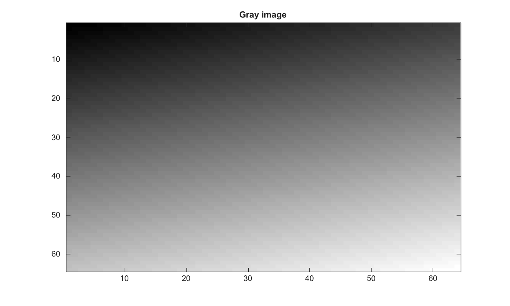

# im2gray

Convert RGB image to grayscale and pass grayscale images through.

## 📝 Syntax

- J = im2gray(I)

## 📥 Input argument

- I - Input numeric grayscale image or m-by-n-by-3 RGB image.

## 📤 Output argument

- J - Grayscale image. Existing grayscale inputs are returned unchanged.

## 📄 Description


Convert RGB image to grayscale and pass grayscale images through. 

The input must be numeric and non-logical. 3-D inputs must be RGB images with exactly three color planes.

## 💡 Example

Convert an RGB image to grayscale

```matlab
RGB=zeros(64,64,3);
[X,Y]=meshgrid(linspace(0,1,64),linspace(0,1,64));
RGB(:,:,1)=X; RGB(:,:,2)=Y; RGB(:,:,3)=1-X;
G=im2gray(RGB);
figure; imagesc(G); g=linspace(0,1,64)'; colormap([g g g]); title('Gray image');
```



## 🔗 See also

[rgb2gray](../../../image_processing/1_image_basics/1_image_types_color/rgb2gray.md), [ind2gray](../../../image_processing/1_image_basics/1_image_types_color/ind2gray.md), [im2double](../../../image_processing/1_image_basics/1_image_types_color/im2double.md).

## 🕔 History

| Version | 📄 Description     |
| ------- | --------------- |
| 2.0.0   | initial version |

<!--
## 👤 Author

Allan CORNET
-->
