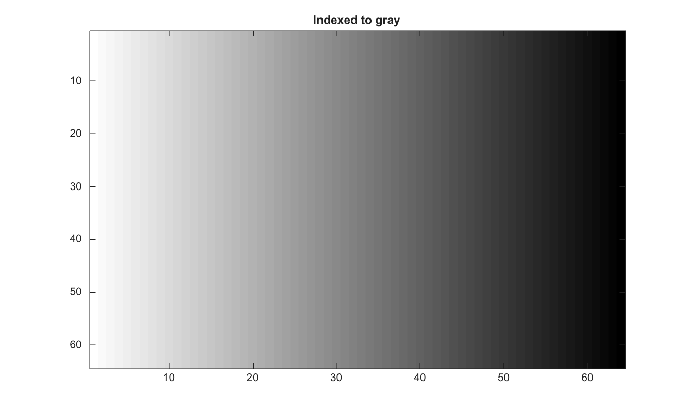

# ind2gray

Convert indexed image to grayscale using a colormap.

## 📝 Syntax

- I = ind2gray(X, map)

## 📥 Input argument

- X - Indexed image.
- map - Colormap with at least three columns.

## 📤 Output argument

- I - Double grayscale image obtained from the indexed RGB image.

## 📄 Description

Convert indexed image to grayscale using a colormap.

## 💡 Example

Convert indexed image to grayscale

```matlab
X=repmat(uint8(0:63),64,1);
v=linspace(0,1,64)'; map=[v 1-v 0.5*ones(64,1)];
G=ind2gray(X,map);
figure; imagesc(G); g=linspace(0,1,64)'; colormap([g g g]); title('Indexed to gray');
```



## 🔗 See also

[ind2rgb](../../../image_processing/ind2rgb.md), [rgb2gray](../../../image_processing/rgb2gray.md), [im2gray](../../../image_processing/im2gray.md).

## 🕔 History

| Version | 📄 Description  |
| ------- | --------------- |
| 2.0.0   | initial version |

<!--
## 👤 Author

Allan CORNET
-->
