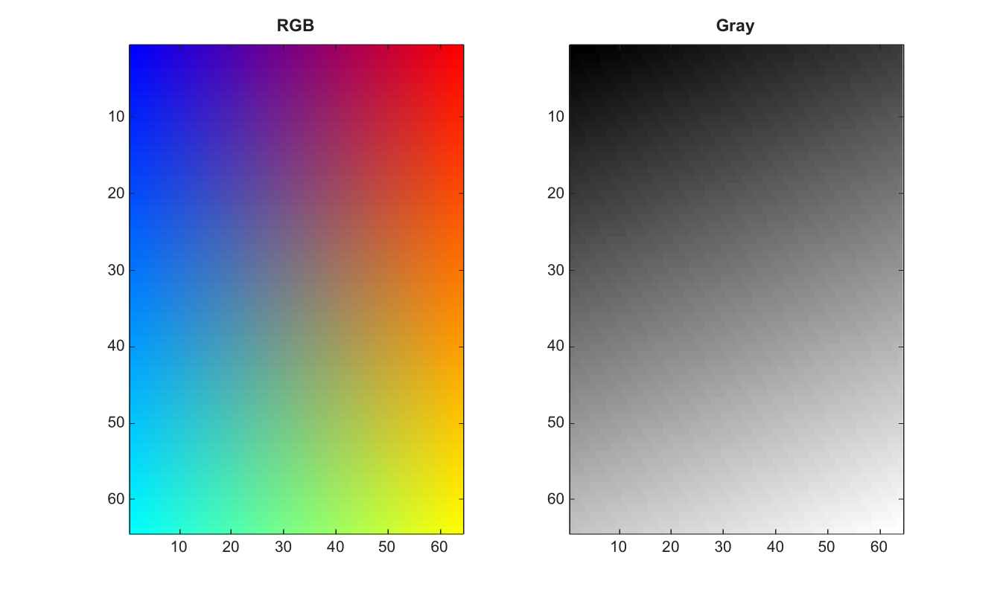

# rgb2gray

Convert RGB image to grayscale.

## 📝 Syntax

- I = rgb2gray(RGB)
- graymap = rgb2gray(map)

## 📥 Input argument

- RGB - m-by-n-by-3 RGB image.
- map - Nonempty double colormap with three columns.

## 📤 Output argument

- I - Grayscale image with class matching the RGB input.
- graymap - Grayscale colormap with the same size as map.

## 📄 Description

Convert RGB image to grayscale.

RGB images can be double, single, or integer arrays. Logical RGB images are not supported.

A nonempty double colormap with three columns is converted to a grayscale colormap with the same size. Colormap values are combined directly and are not clipped.

## 💡 Example

Convert RGB image to grayscale

```matlab
RGB=zeros(64,64,3);
[X,Y]=meshgrid(linspace(0,1,64),linspace(0,1,64));
RGB(:,:,1)=X; RGB(:,:,2)=Y; RGB(:,:,3)=1-X;
G=rgb2gray(RGB);
figure; subplot(1,2,1); image(RGB); title('RGB');
subplot(1,2,2); imagesc(G); g=linspace(0,1,64)'; colormap([g g g]); title('Gray');
```



## 🔗 See also

[im2gray](../../../image_processing/im2gray.md), [ind2gray](../../../image_processing/ind2gray.md).

## 🕔 History

| Version | 📄 Description  |
| ------- | --------------- |
| 2.0.0   | initial version |

<!--
## 👤 Author

Allan CORNET
-->
