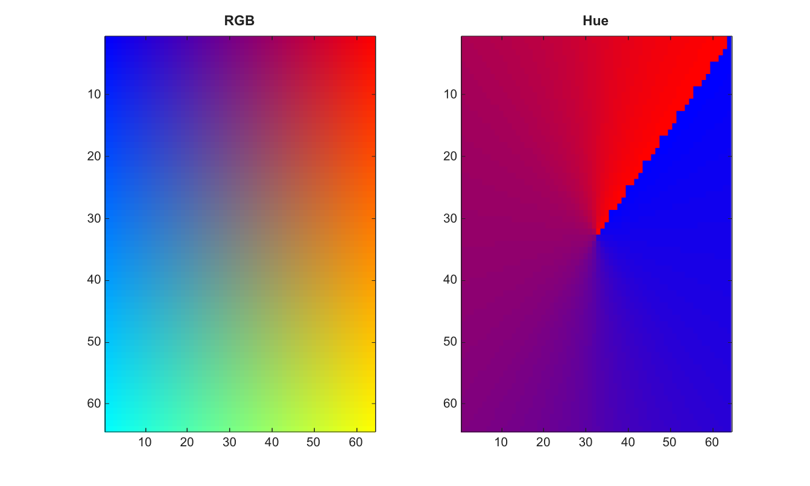

# rgb2hsv

Convert RGB color values to HSV color values.

## 📝 Syntax

- HSV = rgb2hsv(RGB)
- hsvmap = rgb2hsv(map)

## 📥 Input argument

- RGB - m-by-n-by-3 RGB image with class double, single, uint8, or uint16.
- map - Double RGB colormap with values in the range [0, 1].

## 📤 Output argument

- HSV - HSV image. The output is single only when the input image is single; otherwise it is double.
- hsvmap - HSV colormap with the same number of rows as map.

## 📄 Description


Convert RGB color values to HSV color values. RGB images must be real double, single, uint8, or uint16 arrays. Floating-point RGB image values are converted without clipping. Empty RGB images preserve their size. 

A double RGB colormap with values in [0, 1] is converted row by row.

## 💡 Example

Display hue channel from RGB to HSV conversion

```matlab
RGB=zeros(64,64,3);
[X,Y]=meshgrid(linspace(0,1,64),linspace(0,1,64));
RGB(:,:,1)=X; RGB(:,:,2)=Y; RGB(:,:,3)=1-X;
HSV=rgb2hsv(RGB);
figure; subplot(1,2,1); image(RGB); title('RGB');
subplot(1,2,2); imagesc(HSV(:,:,1)); t=linspace(0,1,64)'; colormap([t zeros(64,1) 1-t]); title('Hue');
```



## 🔗 See also

[hsv2rgb](../../../image_processing/1_image_basics/1_image_types_color/hsv2rgb.md), [rgb2ycbcr](../../../image_processing/1_image_basics/1_image_types_color/rgb2ycbcr.md).

## 🕔 History

| Version | 📄 Description     |
| ------- | --------------- |
| 2.0.0   | initial version |

<!--
## 👤 Author

Allan CORNET
-->
